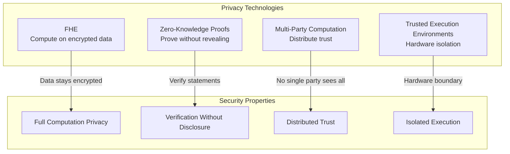
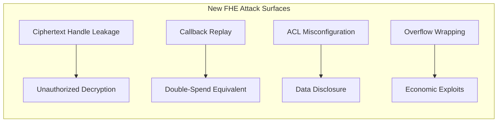
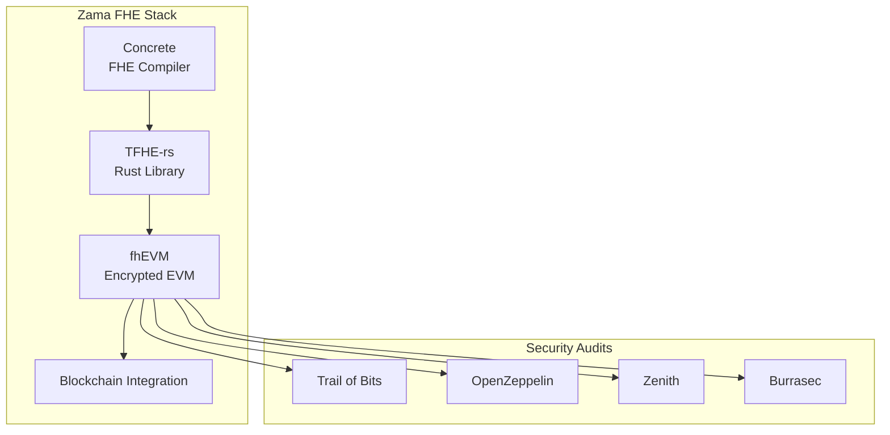
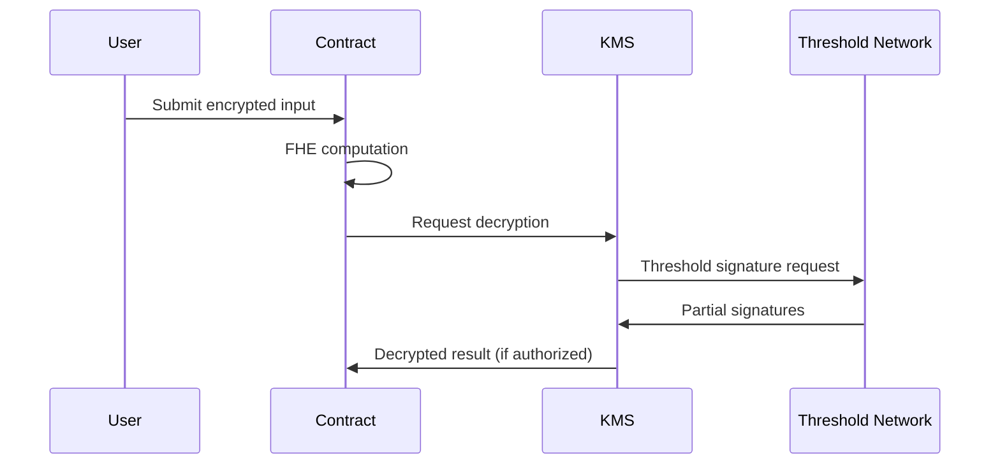
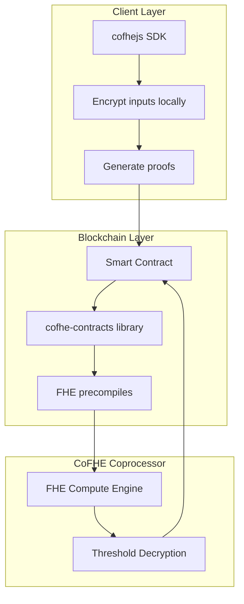
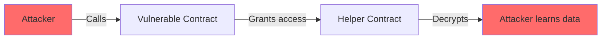
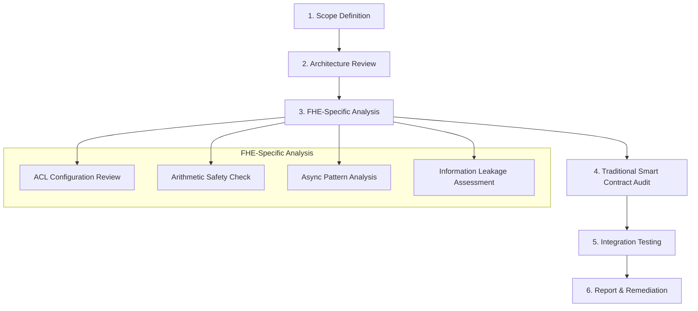

# FHE Security Handbook

> WIP: improvement needed

**A Security-Focused Guide to Fully Homomorphic Encryption for Web3 Protocols**

*Aligned with Zama fhEVM, Fhenix CoFHE, and Web3 Security Best Practices*

---

## Table of Contents

1. [Introduction to FHE for Security Engineers & Developers](#chapter-1-introduction)
2. [Cryptographic Foundations & Security Properties](#chapter-2-cryptographic-foundations)
3. [Zama fhEVM - Architecture & Security Model](#chapter-3-zama-fhevm)
4. [Fhenix CoFHE Protocol - Deep Dive & Security](#chapter-4-fhenix-cofhe)
5. [Common Vulnerabilities in FHE Smart Contracts](#chapter-5-vulnerabilities)
6. [Security Best Practices & Secure Design Patterns](#chapter-6-best-practices)
7. [Auditing FHE Protocols - A Security Engineer's Guide](#chapter-7-auditing)
8. [Ecosystem, Research & Future Directions](#chapter-8-ecosystem)
9. [Appendices](#appendices)

---

# Chapter 1: Introduction {#chapter-1-introduction}

## What is Fully Homomorphic Encryption?

**Fully Homomorphic Encryption (FHE)** is a revolutionary cryptographic technique that allows computations to be performed directly on encrypted data without ever decrypting it. The result of any computation remains encrypted and can only be decrypted by the holder of the secret key.

```
┌─────────────────────────────────────────────────────────────┐
│                    Traditional Encryption                    │
├─────────────────────────────────────────────────────────────┤
│  Encrypt(data) → ciphertext                                 │
│  Decrypt(ciphertext) → data                                 │
│  Compute(data) → result  ← Data exposed during computation! │
└─────────────────────────────────────────────────────────────┘

┌─────────────────────────────────────────────────────────────┐
│                   Homomorphic Encryption                     │
├─────────────────────────────────────────────────────────────┤
│  Encrypt(data) → ciphertext                                 │
│  Compute(ciphertext) → encrypted_result                     │
│  Decrypt(encrypted_result) → result                         │
│  ↑ Data NEVER exposed during computation!                   │
└─────────────────────────────────────────────────────────────┘
```

### Why FHE Matters for Web3

Blockchains are inherently **transparent** - all transaction data, smart contract state, and computations are publicly visible. This creates fundamental privacy challenges:

| Problem | Traditional Blockchain | With FHE |
|---------|----------------------|----------|
| Account balances | Publicly visible | Encrypted |
| Transaction amounts | Publicly visible | Encrypted |
| Smart contract logic | Executes on plaintext | Executes on ciphertext |
| MEV exploitation | Easy to front-run | Data hidden from validators |
| Regulatory compliance | Privacy violations | GDPR-compatible |

## Brief History of FHE

| Year | Milestone |
|------|-----------|
| 1978 | Rivest, Adleman, Dertouzos propose the concept |
| 2009 | Craig Gentry achieves first FHE construction (impractical) |
| 2011-2014 | BGV, BFV, CKKS schemes developed |
| 2016 | TFHE enables fast bootstrapping |
| 2022+ | Zama, Fhenix bring FHE to production Web3 |

## FHE vs Other Privacy Technologies



### Comparative Security Analysis

| Technology | Data Privacy | Computation Privacy | Trust Model | Performance |
|------------|-------------|---------------------|-------------|-------------|
| **FHE** | ✅ Full | ✅ Full | Cryptographic | Slow (improving) |
| **ZK Proofs** | ✅ Full | ❌ Prover sees data | Cryptographic | Medium |
| **MPC** | ⚠️ Shared | ⚠️ Distributed | N-of-M threshold | Medium |
| **TEE** | ⚠️ Hardware | ⚠️ Hardware | Hardware vendor | Fast |

> [!IMPORTANT]
> **Key Insight for Security Engineers**: FHE and ZK are complementary. ZK proves correctness without revealing data; FHE allows computation on hidden data. Many production systems combine both.

## Unique Security Challenges in FHE

### Why FHE Changes the Audit Landscape

Traditional smart contract audits focus on:
- Reentrancy attacks
- Integer overflow/underflow
- Access control bypass
- Logic errors

**FHE introduces entirely new attack surfaces:**

1. **Encrypted arithmetic behaves differently** - No reverts on overflow (would leak information)
2. **Access control on ciphertexts** - Who can decrypt what, and when?
3. **Asynchronous decryption** - Callback patterns introduce race conditions
4. **Information leakage** - Timing, access patterns, and metadata can leak data

### Traditional Assumptions That No Longer Apply

| Traditional Assumption | FHE Reality |
|----------------------|-------------|
| Overflow/underflow reverts | Silently wraps to prevent info leakage |
| View functions are safe | Decryption can leak state |
| Gas costs are predictable | FHE operations 100-10,000x more expensive (addition: ~100-200x, multiplication: ~1,000-5,000x, comparisons: ~500-2,000x) |
| All state is public | Encrypted state requires permission to read |

### New Attack Surfaces



## Real-World Applications and Threat Models

### Application Categories

1. **Confidential DeFi**
   - Private lending with encrypted credit scores
   - Hidden order books and MEV protection
   - Encrypted liquidity positions

2. **Private Governance**
   - Anonymous voting with verifiable tallying
   - Encrypted DAO proposals until execution

3. **Confidential Tokens (FHERC20)**
   - Hidden balances and transfer amounts
   - Compliant with regulatory requirements
   - *Note: FHERC20 is a proposed naming convention for confidential tokens on FHE-enabled chains, analogous to ERC20 but with encrypted balances. No formal EIP standard exists yet.*

4. **Sealed-Bid Auctions**
   - Bids remain encrypted until reveal
   - Fair price discovery

### Threat Model Considerations

**Actors:**
- **Validators/Sequencers**: Can see transaction ordering, gas usage, access patterns
- **Other Users**: Cannot see encrypted values but can observe behavior
- **Protocol Operators**: May control threshold decryption keys
- **External Attackers**: Side-channel attacks, replay attacks

**Trust Assumptions:**
- FHE coprocessors are trusted for computation
- Threshold decryption network is Byzantine fault tolerant
- Client-side encryption is performed correctly

---

# Chapter 2: Cryptographic Foundations & Security Properties {#chapter-2-cryptographic-foundations}

## Mathematical Prerequisites

### Lattice-Based Cryptography

FHE security relies on the hardness of lattice problems, primarily:

**Learning With Errors (LWE):**
Given samples $(a_i, b_i = \langle a_i, s \rangle + e_i)$ where:
- $a_i$ is a random vector
- $s$ is a secret vector
- $e_i$ is small "noise"

Find $s$. This problem is believed to be hard even for quantum computers.

**Ring-LWE:** A more efficient variant operating over polynomial rings.

### Security Assumptions

| Assumption | Description | Quantum Secure? |
|------------|-------------|-----------------|
| LWE | Learning With Errors | ✅ Yes |
| RLWE | Ring-LWE | ✅ Yes |
| NTRU | Number Theory Research Unit | ⚠️ Variants differ |

> [!NOTE]
> **For Security Engineers**: Always verify the specific lattice parameters used. Older schemes used "overstretched" NTRU parameters vulnerable to subfield attacks.

## FHE Schemes Overview

### Scheme Comparison

| Scheme | Data Type | Exact? | Speed | Use Case |
|--------|-----------|--------|-------|----------|
| **BGV** | Integers | ✅ | Medium | General computation |
| **BFV** | Integers | ✅ | Medium | Smart contracts |
| **CKKS** | Approx. floats | ❌ (~10-20 bits) | Fast | ML/Analytics |
| **TFHE** | Bits/small ints | ✅ | Fast bootstrap | Fhenix, Zama |
| **dBFV** | Integers | ✅ Exact | Medium | Fhenix (optimized noise) |

### TFHE (Torus FHE)

Used by both Zama and Fhenix. Key properties:

- **Fast bootstrapping**: ~10ms per operation (vs seconds for others)
- **Programmable bootstrapping**: Evaluate lookup tables during noise refresh
- **Bit-level operations**: Native AND, OR, XOR gates

### dBFV (Decomposed BFV)

Fhenix's novel scheme from their [white paper](https://eprint.iacr.org/2025/2321):

- **High precision**: Exact arithmetic without approximation errors
- **Decomposed operations**: Better noise management
- **Optimized for smart contracts**: Reduced gas costs

## Common Cryptographic Vulnerabilities

### 1. Lattice-Based Attacks

**Subfield Lattice Attack:**
- Affects NTRU-based schemes with poor parameter choices
- **Historical Note**: LTV (Lopez-Alt et al., 2012) and BLLN (Brakerski-Langlois-Lepoint-Naehrig, 2013) were early FHE schemes broken by subfield lattice attacks in 2015-2016
- Modern schemes (TFHE, BGV, BFV, CKKS) use different algebraic structures and parameter regimes
- **Audit check**: Verify scheme is not using deprecated constructions (LTV, BLLN, overstretched NTRU)

**Dual Lattice Attack:**
- Exploits weak modulus-to-dimension ratios
- **Audit check**: Verify security level claims (128-bit minimum recommended)

### 2. Key Recovery Attacks

Recent research has demonstrated practical key recovery against major FHE libraries:

| Library | Attack Type | Status |
|---------|-------------|--------|
| SEAL | Chosen ciphertext | Patched |
| OpenFHE | Timing side-channel | Patched |
| TFHE-rs | Power analysis | Mitigated |
| Lattigo | Parameter weakness | Patched |

> [!CAUTION]
> **Security Engineers**: Always verify the library version. Many attacks have been patched in recent releases. Check CVE databases and library changelogs.

### 3. Noise Management Failures

FHE ciphertexts contain "noise" that grows with each operation:

```
Initial encryption:     noise = small
After addition:         noise ≈ noise1 + noise2
After multiplication:   noise ≈ (noise1 × plaintext2) + (noise2 × plaintext1) + (noise1 × noise2)
                        ^ Grows proportional to BOTH noise AND plaintext values!
After too many ops:     DECRYPTION FAILS (or worse, returns incorrect result)
```

**Vulnerabilities:**
- **Noise overflow**: Incorrect decryption without error indication
- **Noise-based distinguishers**: CKKS approximate values can leak bits
- **Bootstrapping failures**: Can corrupt ciphertexts

### 4. Parameter Selection Pitfalls

| Parameter Issue | Vulnerability |
|----------------|---------------|
| Small modulus | Noise overflow, incorrect decryption |
| Large modulus | Weakened security margin |
| Wrong ring dimension | Lattice attack susceptibility |
| Insufficient bootstrapping | Noise accumulation |

## Security Guarantees and Limitations

### IND-CPA (Indistinguishability under Chosen Plaintext Attack)

Standard FHE security guarantee:
- Attacker cannot distinguish encryptions of different messages
- Does NOT protect against chosen ciphertext attacks (IND-CCA)
- FHE schemes are inherently malleable and typically achieve only IND-CPA security

**Security Level**: Modern FHE implementations target 128-bit IND-CPA security:
- Based on quantum-resistant lattice assumptions (LWE/RLWE)
- Resistant to all known classical and quantum attacks
- Zama and Fhenix both target 128-bit security parameters

> [!WARNING]
> **Fundamental Limitation**: FHE is inherently malleable. An attacker can modify ciphertexts to compute on the underlying data without knowing the plaintext. This is by design (enabling computation), but requires careful access control and authentication mechanisms at the application layer.

---

# Chapter 3: Zama fhEVM - Architecture & Security Model {#chapter-3-zama-fhevm}

## Overview of Zama's Approach

Zama provides a complete FHE stack for Web3:



### Stack Components

**Concrete**: Zama's domain-specific language (DSL) and compiler for FHE. It allows developers to write high-level FHE programs that compile to optimized TFHE operations. Concrete provides:
- High-level API for expressing encrypted computations
- Automatic parameter selection and optimization
- Noise budget tracking and management
- Compilation to efficient TFHE-rs operations

**TFHE-rs**: High-performance Rust implementation of TFHE primitives, providing the cryptographic foundation.

**fhEVM**: Modified Ethereum Virtual Machine supporting FHE operations via precompiles.

### Security Audit Coverage

Zama's protocol underwent **~70 audit-weeks** covering:

| Component | Auditors | Focus |
|-----------|----------|-------|
| TFHE-rs core | Trail of Bits | Cryptographic correctness |
| KMS (Key Management) | Zenith, Alexandra Institute | Key security, threshold crypto |
| Coprocessor | OpenZeppelin | Smart contract security |
| Gateway | Burrasec | Communication security |
| fhEVM contracts | OpenZeppelin | Solidity vulnerabilities |

## TFHE-rs: High-Performance Rust Implementation

### Security Properties

1. **Memory Safety**: Rust's ownership model prevents common C/C++ vulnerabilities
2. **Constant-time operations**: Critical paths are timing-attack resistant
3. **Parameter validation**: Invalid parameters rejected at compile time where possible

### Side-Channel Considerations

| Attack Vector | TFHE-rs Status | Notes |
|--------------|----------------|-------|
| Timing attacks | Partial mitigation | Core operations constant-time; bootstrapping reveals circuit depth |
| Power analysis | Hardware-dependent | Standard DPA countermeasures applied at hardware level |
| Cache attacks | Active research | Memory access pattern obfuscation; not guaranteed secure |
| Electromagnetic | Hardware-dependent | Requires physical access; standard shielding practices |

> [!NOTE]
> **Audit Tip**: When auditing TFHE-rs integrations, verify that wrapper code doesn't introduce timing variations (e.g., early returns on error conditions).

## fhEVM Architecture

### Modified EVM Design

```
┌─────────────────────────────────────────────────────────────┐
│                         fhEVM                                │
├─────────────────────────────────────────────────────────────┤
│  Standard EVM Opcodes    │  FHE Precompiles                 │
│  ─────────────────────   │  ─────────────────               │
│  ADD, MUL, CALL, etc.    │  FHE.add(euint, euint)           │
│                          │  FHE.mul(euint, euint)           │
│                          │  FHE.select(ebool, euint, euint) │
│                          │  FHE.decrypt(...)                 │
└─────────────────────────────────────────────────────────────┘
```

### Encrypted Types

| Type | Description | Size |
|------|-------------|------|
| `ebool` | Encrypted boolean | - |
| `euint8` | Encrypted 8-bit unsigned | 8-bit plaintext |
| `euint16` | Encrypted 16-bit unsigned | 16-bit plaintext |
| `euint32` | Encrypted 32-bit unsigned | 32-bit plaintext |
| `euint64` | Encrypted 64-bit unsigned | 64-bit plaintext |
| `eaddress` | Encrypted address | 160-bit plaintext |

### Key Management System (KMS) Security Model



**Trust Assumptions:**
- KMS nodes are semi-honest (follow protocol but may try to learn)
- Threshold (e.g., 2-of-3) prevents single-point-of-failure
- Network must remain available for decryption

### Gas Optimization vs Security Trade-offs

| Optimization | Security Implication |
|--------------|---------------------|
| Batching FHE operations | Reduces gas but increases complexity |
| Lazy decryption | Saves gas but defers security checks |
| Ciphertext caching | Memory efficient but risks stale data |
| Reduced precision types | Lower gas but potential overflow |

> [!WARNING]
> **For Auditors**: Be skeptical of gas optimizations in FHE contracts. The 1000x+ cost difference incentivizes shortcuts that may compromise security.

## Critical Security Findings from Audits

### 128-bit Security Target

Zama targets **128-bit IND-CPA security** based on lattice assumptions:
- Resistant to all known classical attacks (lattice reduction, dual attacks)
- Based on quantum-resistant LWE/RLWE assumptions (secure against Shor's algorithm)
- Parameters sized to maintain 128-bit security against Grover's quadratic speedup
- Formally verified parameter selection using lattice estimator tools

### Known Limitations

1. **Decryption latency**: Threshold decryption adds network delay (typically 1-5 seconds)
2. **Ciphertext size**: ~1KB per encrypted value (storage cost)
3. **Operation cost**: Variable by operation type:
   - Addition/Subtraction: ~100-200x more gas than plaintext
   - Multiplication: ~1,000-5,000x more gas
   - Comparisons/Select: ~500-2,000x more gas
   - Bootstrapping (if needed): ~10,000x+ more gas
4. **Bootstrapping requirements**: Deep computations need periodic noise refresh

---

# Chapter 4: Fhenix CoFHE Protocol - Deep Dive & Security {#chapter-4-fhenix-cofhe}

## CoFHE Architecture Overview

Fhenix's **CoFHE (Confidential FHE)** is a coprocessor architecture that offloads FHE computations from the blockchain:



## Core Components Security Analysis

### Client-Side Encryption (cofhejs)

**Trust Model:**
- User's browser/client performs encryption
- Private key never leaves client
- Contract receives only ciphertexts

```javascript
// cofhejs example - client-side encryption
import { Cofhe } from 'cofhejs';

const cofhe = await Cofhe.create({ provider });

// Encrypt locally before sending to contract
const encryptedAmount = await cofhe.encrypt(100, 'uint64');
const proof = await cofhe.generateProof(encryptedAmount);

// Send to contract
await contract.deposit(encryptedAmount, proof);
```

**Security Considerations:**
- Client must use secure random number generation
- Encryption must be performed in secure context (not exposed to XSS)
- Proof generation must be deterministic to prevent manipulation

### Smart Contract Library (cofhe-contracts)

Core Solidity library for FHE operations:

```solidity
// SPDX-License-Identifier: MIT
pragma solidity ^0.8.20;

import {FHE, euint64, ebool} from "@fhenix/cofhe-contracts/FHE.sol";

contract ConfidentialToken {
    mapping(address => euint64) private balances;
    
    function transfer(address to, euint64 encAmount) external {
        // FHE comparison - no plaintext exposure
        ebool hasBalance = FHE.gte(balances[msg.sender], encAmount);
        
        // Conditional update using encrypted select
        balances[msg.sender] = FHE.select(
            hasBalance,
            FHE.sub(balances[msg.sender], encAmount),
            balances[msg.sender]
        );
        
        balances[to] = FHE.select(
            hasBalance,
            FHE.add(balances[to], encAmount),
            balances[to]
        );
    }
}
```

**Security Patterns:**
- Use `FHE.select()` for conditional logic on confidential data (prevents branch-based leakage)
- Avoid decrypting values in require/assert if it would leak confidential information
- Decryption is acceptable when the value is intentionally being revealed (e.g., final auction results)
- Always check ACL permissions before operations

### FHE Coprocessor Security

| Aspect | Design | Security Implication |
|--------|--------|---------------------|
| Computation | Off-chain in coprocessor | Must trust coprocessor correctness |
| Verification | On-chain proof checking | Computational integrity guaranteed |
| Availability | Centralized (current) | Single point of failure |
| Decryption | Threshold network | Requires threshold honesty |

> [!WARNING]
> **Current Limitation**: The FHE coprocessor is a trusted component. Malicious coprocessor could return incorrect results. Future versions may add ZK proofs of correct computation.

## dBFV Scheme (Decomposed BFV)

Fhenix's novel contribution from their [white paper](https://eprint.iacr.org/2025/2321):

### Security Improvements Over Standard BFV

| Feature | Standard BFV | dBFV |
|---------|-------------|------|
| Precision | Limited by modulus | High precision via decomposition |
| Noise growth | Multiplicative | Better controlled |
| Bootstrapping | Expensive | Optimized |
| Parameter flexibility | Fixed | Adaptive |

### Known Limitations and Attack Vectors

1. **Parameter Dependencies**: Security relies on correct decomposition parameters
2. **Implementation Complexity**: More code paths = more potential bugs
3. **Interoperability**: May not be compatible with standard BFV implementations

## Threshold Decryption Network

### Security Architecture

```mermaid
sequenceDiagram
    participant Contract
    participant Gateway
    participant Node1 as TDN Node 1
    participant Node2 as TDN Node 2
    participant Node3 as TDN Node 3
    
    Contract->>Gateway: Decrypt request + ACL proof
    Gateway->>Node1: Partial decrypt request
    Gateway->>Node2: Partial decrypt request
    Gateway->>Node3: Partial decrypt request
    Node1->>Gateway: Partial decryption σ1
    Node2->>Gateway: Partial decryption σ2
    Gateway->>Gateway: Combine partials (2-of-3)
    Gateway->>Contract: Decrypted value + proof
```



### Byzantine Fault Tolerance

**Threshold Configuration (t-of-n):**
- **Threshold**: t signatures required to decrypt
- **Total nodes**: n nodes in the network
- **Liveness**: Requires at least **t honest nodes available** to complete decryption
- **Safety**: Requires **fewer than t nodes compromised** to prevent unauthorized decryption
- **Example**: In 2-of-3 setup:
  - Can tolerate 1 node failure (liveness: 2 nodes can still decrypt)
  - Prevents compromise if only 1 node is malicious (safety: need 2 to decrypt)

**Key Compromise Scenarios:**

| Scenario | Impact | Mitigation |
|----------|--------|------------|
| 1 node compromised | No impact (below threshold) | Node rotation |
| t nodes compromised | Decryption possible | Emergency key rotation |
| All nodes compromised | Full data exposure | Multi-layer encryption |

## Access Control Lists (ACL) - Critical Security Component

### ACL Design

Every ciphertext has an associated ACL controlling:
- Who can perform operations on it
- Who can request decryption
- Transient vs persistent permissions

```solidity
// ACL pattern
function grantAccess(euint64 ciphertext, address user) internal {
    FHE.allow(ciphertext, user);  // Persistent permission
}

function grantTransientAccess(euint64 ciphertext) internal {
    FHE.allowTransient(ciphertext, msg.sender);  // Transaction-scoped
}
```

### Common ACL Vulnerabilities

> [!CAUTION]
> ACL misconfigurations are the #1 source of FHE smart contract vulnerabilities.

| Vulnerability | Description | Impact |
|--------------|-------------|--------|
| Over-permissioning | Granting permanent access when transient needed | Data leakage |
| Missing validation | Not checking caller before granting access | Unauthorized decryption |
| Propagation to untrusted | Allowing helper contracts to pass permissions | Disclosure oracle |

---

# Chapter 5: Common Vulnerabilities in FHE Smart Contracts {#chapter-5-vulnerabilities}

*Based on OpenZeppelin audit findings and production security research*

## Category 1: Arithmetic Vulnerabilities

### Unchecked Overflow/Underflow

**The Problem:**
In traditional Solidity 0.8+, arithmetic overflow reverts. In FHE, **this would leak information** (attacker learns value was too large), so operations silently wrap.

**Vulnerable Pattern:**

```solidity
// ❌ VULNERABLE: Fee can wrap to ~0 on large amounts
function calculateFee(euint64 amount) public returns (euint64) {
    euint64 fee = FHE.mul(amount, FHE.asEuint64(feePercent));
    return FHE.div(fee, FHE.asEuint64(100));
}
// Attack: amount = MAX_UINT64 / feePercent + 1 → fee wraps to tiny value
```

**Secure Pattern:**

```solidity
// ✅ SECURE: Clamp fee to maximum safe value
function calculateFee(euint64 amount) public returns (euint64) {
    euint64 fee = FHE.mul(amount, FHE.asEuint64(feePercent));
    fee = FHE.div(fee, FHE.asEuint64(100));
    
    // Encrypted overflow check
    ebool overflowed = FHE.gt(amount, FHE.asEuint64(MAX_SAFE_AMOUNT));
    
    // Clamp to maximum fee if overflow detected
    return FHE.select(overflowed, FHE.asEuint64(MAX_FEE), fee);
}
```

**Audit Checklist:**
- [ ] All multiplications checked for potential overflow
- [ ] Division results validated against reasonable bounds
- [ ] Select statements used to handle edge cases

## Category 2: Information Leakage

### Missing Authorization on Ciphertext Handles

**The Problem:**
Contracts may grant decrypt permissions to helpers without validating the original caller's permissions.

**Root Cause**: The function accepts a ciphertext handle from the caller without verifying the caller has permission to use it. This allows attackers to pass ciphertext handles they don't own but have observed (e.g., from blockchain events, transaction logs, or contract storage). The vulnerability creates a **permission amplification** attack where the contract unwittingly grants its own access rights to unauthorized parties.

**Vulnerable Pattern:**

```solidity
// ❌ VULNERABLE: Helper gets access without caller validation
contract VulnerableVault {
    function processWithHelper(euint64 data) external {
        // Grants helper permanent access - anyone calling this
        // gives helper access to their ciphertext
        FHE.allow(data, address(helper));
        helper.process(data);
    }
}

contract MaliciousHelper {
    function process(euint64 data) external {
        // Can now decrypt any ciphertext passed to processWithHelper
        FHE.decrypt(data);  // Disclosure oracle!
    }
}
```

**Secure Pattern:**

```solidity
// ✅ SECURE: Validate caller has permission before granting
contract SecureVault {
    function processWithHelper(euint64 data) external {
        // Verify caller actually owns/has permission on this ciphertext
        require(FHE.isAllowed(data, msg.sender), "Unauthorized");
        
        // Use transient permission instead of persistent
        FHE.allowTransient(data, address(helper));
        helper.process(data);
    }
}
```

### Disclosure Oracle Attacks

**Attack Flow:**



**Audit Checklist:**
- [ ] All `FHE.allow()` calls preceded by permission checks
- [ ] Transient permissions preferred over persistent
- [ ] Helper contracts audited for decrypt calls
- [ ] Callbacks authenticated via modifier checking msg.sender
- [ ] Gateway address immutable and set at deployment

## Category 3: Asynchronous Decryption Vulnerabilities

### Stateless Callback Replay

**The Problem:**
Async decryption uses callbacks. If the request state isn't invalidated, callbacks can be replayed.

**Vulnerable Pattern:**

```solidity
// ❌ VULNERABLE: Request not invalidated after callback
mapping(bytes32 => WithdrawRequest) public requests;

function requestWithdraw(euint64 amount) external {
    bytes32 reqId = keccak256(abi.encodePacked(msg.sender, block.number));
    requests[reqId] = WithdrawRequest({user: msg.sender, amount: amount});
    
    FHE.requestDecrypt(amount, this.withdrawCallback.selector, reqId);
}

function withdrawCallback(bytes32 reqId, uint64 decryptedAmount) external {
    WithdrawRequest memory req = requests[reqId];
    // Request still valid! Attacker can replay this callback
    payable(req.user).transfer(decryptedAmount);
}
```

**Secure Pattern:**

```solidity
// ✅ SECURE: Invalidate before external call + authenticate caller
address public immutable AUTHORIZED_GATEWAY;

constructor(address _gateway) {
    AUTHORIZED_GATEWAY = _gateway;
}

modifier onlyGateway() {
    require(msg.sender == AUTHORIZED_GATEWAY, "Unauthorized callback");
    _;
}

function withdrawCallback(bytes32 reqId, uint64 decryptedAmount) 
    external 
    onlyGateway  // Critical: Only gateway can call
{
    WithdrawRequest memory req = requests[reqId];
    require(req.user != address(0), "Invalid or used request");
    
    // DELETE BEFORE TRANSFER (CEI pattern)
    delete requests[reqId];
    
    payable(req.user).transfer(decryptedAmount);
}
```

**Audit Checklist:**
- [ ] All async requests have unique identifiers
- [ ] Request state deleted before external calls
- [ ] Callback can only be called by authorized gateway
- [ ] Re-entrancy protection on callbacks

## Category 4: Auction & Bidding Vulnerabilities

### Silently Failing Transfers

**The Problem:**
In confidential auctions, a bid might fail silently (insufficient balance), but the auction still records the bid amount.

**Vulnerable Pattern:**

```solidity
// ❌ VULNERABLE: Compares requested amount, not actual transfer
function bid(euint64 bidAmount) external {
    // This might transfer 0 if user has insufficient balance!
    euint64 transferred = FHE.transferFrom(msg.sender, address(this), bidAmount);
    
    // But we compare against the REQUESTED amount
    ebool isHigher = FHE.gt(bidAmount, highestBid);
    highestBid = FHE.select(isHigher, bidAmount, highestBid);
    // Attacker "wins" with 0 actual transfer!
}
```

**Secure Pattern:**

```solidity
// ✅ SECURE: Compare actual transferred amount
function bid(euint64 bidAmount) external {
    euint64 transferred = FHE.transferFrom(msg.sender, address(this), bidAmount);
    
    // Verify something was actually transferred
    ebool validTransfer = FHE.gt(transferred, FHE.asEuint64(0));
    
    // Compare TRANSFERRED amount, not requested
    ebool isHigher = FHE.and(
        validTransfer,
        FHE.gt(transferred, highestBid)
    );
    
    highestBid = FHE.select(isHigher, transferred, highestBid);
    highestBidder = FHE.select(isHigher, msg.sender, highestBidder);
}
```

### Information Disclosure via Reorgs

**The Problem:**
If auction winner info is revealed immediately, a blockchain reorg could let a temporary winner learn secrets even if they're later replaced.

**Mitigation:**

```solidity
// Two-step reveal with finality delay
uint256 public constant FINALITY_DELAY = 32; // blocks

function scheduleReveal() external {
    require(auctionEnded, "Auction not ended");
    revealTimestamp = block.number + FINALITY_DELAY;
}

function claimPrize() external {
    require(block.number >= revealTimestamp, "Finality delay not passed");
    // Now safe to decrypt winner info
}
```

## Category 5: Access Control Bypass

### Arbitrary External Calls

**The Problem:**
Contracts with generic `execute()` functions can be exploited to call the ACL contract directly.

**Vulnerable Pattern:**

```solidity
// ❌ VULNERABLE: Arbitrary calls can manipulate ACL
contract VulnerableExecutor {
    function execute(address target, bytes calldata data) external onlyOwner {
        (bool success,) = target.call(data);
        require(success);
    }
}
// Attacker: execute(ACL_ADDRESS, FHE.allow(victimCiphertext, attacker))
```

**Secure Pattern:**

```solidity
// ✅ SECURE: Blocklist sensitive targets
contract SecureExecutor {
    mapping(address => bool) public blockedTargets;
    
    constructor() {
        blockedTargets[FHE.ACL_ADDRESS] = true;
        blockedTargets[FHE.GATEWAY_ADDRESS] = true;
    }
    
    function execute(address target, bytes calldata data) external onlyOwner {
        require(!blockedTargets[target], "Blocked target");
        (bool success,) = target.call(data);
        require(success);
    }
}
```

## Category 6: Account Abstraction (AA) Risks

### Transient Storage Sharing

**The Problem:**
In AA environments, multiple user operations share a transaction. Transient permissions from one user could leak to another.

**Vulnerable Scenario:**

```
Transaction containing:
  UserOp1 (Alice): Grants transient permission to ciphertext C
  UserOp2 (Bob):   Can access Alice's ciphertext C via shared transient storage!
```

**Mitigation:**

```solidity
// AA wallet must clean transient storage between operations
function executeUserOp(UserOperation calldata op) external {
    // ... execute operation ...
    
    // Clean FHE transient storage after each user op
    FHE.cleanTransientStorage();
}
```

## Category 7: Implementation-Level Vulnerabilities

### Side-Channel Attacks

| Attack | Description | Mitigation |
|--------|-------------|------------|
| Timing | Operation duration reveals data | Constant-time implementations |
| Power | Power consumption patterns | Hardware countermeasures |
| Cache | Memory access patterns | Cache-oblivious algorithms |
| EM | Electromagnetic emissions | Shielding |

### Serialization Vulnerabilities

**Risk:** Malformed ciphertexts could cause:
- Buffer overflows in deserialization
- Type confusion in FHE libraries
- Denial of service via invalid parameters

**Mitigation:**
- Validate all incoming ciphertexts
- Use library-provided deserialization only
- Implement size limits and sanity checks

---

# Chapter 6: Security Best Practices & Secure Design Patterns {#chapter-6-best-practices}

## Secure Coding Guidelines

### Pre-Deployment Security Checklist

Before deploying any FHE smart contract:

```
┌─────────────────────────────────────────────────────────────┐
│                 FHE DEPLOYMENT CHECKLIST                    │
├─────────────────────────────────────────────────────────────┤
│ [ ] All FHE arithmetic operations have overflow guards      │
│ [ ] ACL permissions use transient where possible           │
│ [ ] Async callbacks invalidate state before external calls │
│ [ ] Async callbacks authenticated with onlyGateway modifier│
│ [ ] Avoid decrypt in require/assert for confidential data  │
│ [ ] Auction logic compares transferred, not requested      │
│ [ ] No arbitrary external calls in privileged contexts     │
│ [ ] Finality delays on sensitive reveals                   │
│ [ ] AA environments clean transient storage                │
│ [ ] All ciphertext inputs validated via proofs             │
│ [ ] Gas limits tested for worst-case FHE operations        │
└─────────────────────────────────────────────────────────────┘
```

### Code Review Focus Areas

| Area | What to Check |
|------|---------------|
| `FHE.allow()` | Is caller permission verified? Transient preferred? |
| `FHE.select()` | Are both branches safe? No info leak in selection? |
| Callbacks | State invalidated? Gateway-only callable? Authentication enforced? |
| Arithmetic | Overflow guards? Clamping strategies? |
| Comparisons | Avoid decrypt in require/assert if leaking confidential data? |
| External calls | Blocklisted sensitive targets? |

### Testing Strategies for Encrypted Logic

**Challenge:** You can't inspect encrypted values in tests.

**Solutions:**

```solidity
// 1. Mock mode for development
contract ConfidentialToken {
    bool public mockMode;
    
    function _transfer(euint64 amount) internal {
        if (mockMode) {
            // Use plaintext for testing
            _mockTransfer(FHE.decrypt(amount));
        } else {
            // Production encrypted logic
            _encryptedTransfer(amount);
        }
    }
}

// 2. Event-based verification (decrypt in test)
event BalanceUpdated(address indexed user, bytes32 encryptedBalance);

// 3. Formal verification of logic structure
// Use symbolic execution to verify paths
```

## Design Patterns for Secure FHE Applications

### Secure FHERC20 Pattern

```solidity
// SPDX-License-Identifier: MIT
pragma solidity ^0.8.20;

import {FHE, euint64, ebool} from "@fhenix/cofhe-contracts/FHE.sol";

contract SecureFHERC20 {
    mapping(address => euint64) private _balances;
    euint64 private _totalSupply;
    
    // Maximum safe value to prevent overflow
    uint64 public constant MAX_SUPPLY = type(uint64).max / 2;
    
    function transfer(address to, euint64 amount) external returns (ebool) {
        require(to != address(0), "Zero address");
        require(to != msg.sender, "Self-transfer");
        
        // Check sufficient balance
        ebool sufficient = FHE.gte(_balances[msg.sender], amount);
        
        // Check for overflow in recipient
        euint64 newRecipientBalance = FHE.add(_balances[to], amount);
        ebool noOverflow = FHE.gte(
            FHE.asEuint64(MAX_SUPPLY), 
            newRecipientBalance
        );
        
        // Both conditions must be true
        ebool canTransfer = FHE.and(sufficient, noOverflow);
        
        // Atomic update using select
        _balances[msg.sender] = FHE.select(
            canTransfer,
            FHE.sub(_balances[msg.sender], amount),
            _balances[msg.sender]
        );
        
        _balances[to] = FHE.select(
            canTransfer,
            newRecipientBalance,
            _balances[to]
        );
        
        return canTransfer;
    }
    
    // Secure balance reveal with permit
    function revealBalance(address owner) external returns (uint64) {
        require(msg.sender == owner || _hasPermit(msg.sender, owner));
        FHE.allowTransient(_balances[owner], msg.sender);
        return FHE.decrypt(_balances[owner]);
    }
}
```

### Secure Blind Auction Pattern

```solidity
contract SecureBlindAuction {
    euint64 private highestBid;
    address private highestBidder;
    mapping(address => euint64) private bids;
    
    uint256 public auctionEnd;
    uint256 public revealBlock;
    uint256 public constant FINALITY_DELAY = 32;
    
    bool public auctionEnded;
    bool public winnerRevealed;
    
    function placeBid(euint64 encryptedBid, bytes calldata proof) external {
        require(block.timestamp < auctionEnd, "Auction ended");
        
        // Validate the ciphertext
        euint64 validatedBid = FHE.asEuint64(encryptedBid, proof);
        
        // Transfer bid amount (escrow)
        euint64 transferred = token.encryptedTransferFrom(
            msg.sender, 
            address(this), 
            validatedBid
        );
        
        // Verify actual transfer occurred
        ebool validTransfer = FHE.gt(transferred, FHE.asEuint64(0));
        
        // Update highest bid only if:
        // 1. Transfer succeeded
        // 2. Bid is higher than current highest
        ebool isNewHighest = FHE.and(
            validTransfer,
            FHE.gt(transferred, highestBid)
        );
        
        // Update state
        highestBid = FHE.select(isNewHighest, transferred, highestBid);
        bids[msg.sender] = FHE.add(bids[msg.sender], transferred);
        
        // Store bidder (can't use encrypted select for address)
        if (/* determined via separate reveal mechanism */) {
            highestBidder = msg.sender;
        }
    }
    
    function endAuction() external {
        require(block.timestamp >= auctionEnd, "Auction not ended");
        require(!auctionEnded, "Already ended");
        
        auctionEnded = true;
        revealBlock = block.number + FINALITY_DELAY;
    }
    
    function revealWinner() external {
        require(auctionEnded, "Not ended");
        require(block.number >= revealBlock, "Finality delay");
        require(!winnerRevealed, "Already revealed");
        
        winnerRevealed = true;
        // Now safe to reveal winner
    }
}
```

### Secure Private Voting Pattern

```solidity
contract SecurePrivateVoting {
    struct Proposal {
        euint64 yesVotes;
        euint64 noVotes;
        uint256 endTime;
        bool tallied;
    }
    
    mapping(uint256 => Proposal) public proposals;
    mapping(uint256 => mapping(address => bool)) public hasVoted;
    
    function vote(uint256 proposalId, ebool encryptedVote) external {
        Proposal storage p = proposals[proposalId];
        require(block.timestamp < p.endTime, "Voting ended");
        require(!hasVoted[proposalId][msg.sender], "Already voted");
        
        hasVoted[proposalId][msg.sender] = true;
        
        // Convert bool to uint64 for arithmetic
        euint64 voteAsUint = FHE.asEuint64(encryptedVote);
        euint64 one = FHE.asEuint64(1);
        euint64 zero = FHE.asEuint64(0);
        
        p.yesVotes = FHE.add(
            p.yesVotes,
            FHE.select(encryptedVote, one, zero)
        );
        
        p.noVotes = FHE.add(
            p.noVotes,
            FHE.select(encryptedVote, zero, one)
        );
    }
    
    function tallyVotes(uint256 proposalId) external {
        Proposal storage p = proposals[proposalId];
        require(block.timestamp >= p.endTime, "Voting not ended");
        require(!p.tallied, "Already tallied");
        
        // Only reveal totals, not individual votes
        p.tallied = true;
        // Decrypt and emit results
    }
}
```

## Access Control Best Practices

### Principle of Least Privilege

```solidity
// ❌ BAD: Permanent access
FHE.allow(ciphertext, user);

// ✅ GOOD: Transaction-scoped access
FHE.allowTransient(ciphertext, user);

// ✅ GOOD: Time-limited access
function grantTemporaryAccess(euint64 ct, address user, uint256 duration) {
    accessExpiry[ct][user] = block.timestamp + duration;
    FHE.allowTransient(ct, user);
}
```

### Safe Delegation Patterns

```solidity
// Two-step delegation with approval
mapping(address => mapping(address => bool)) public delegateApprovals;

function approveDelegation(address delegate) external {
    delegateApprovals[msg.sender][delegate] = true;
}

function delegatedAccess(euint64 data, address owner) external {
    require(delegateApprovals[owner][msg.sender], "Not approved");
    require(FHE.isAllowed(data, owner), "Owner lacks permission");
    
    // Grant transient only
    FHE.allowTransient(data, msg.sender);
}
```

## Key Management & Cryptographic Hygiene

### Client-Side Best Practices

1. **Entropy Quality**: Use cryptographically secure RNG
2. **Key Storage**: Never store keys in localStorage (use secure enclaves)
3. **Session Keys**: Rotate keys periodically
4. **Key Derivation**: Use proper KDF (HKDF, Argon2)

### Permit System Security

```solidity
// EIP-712 style permit for FHE access
struct AccessPermit {
    address owner;
    address spender;
    bytes32 ciphertextHash;
    uint256 deadline;
    uint8 v;
    bytes32 r;
    bytes32 s;
}

function permitAccess(AccessPermit calldata permit) external {
    require(block.timestamp <= permit.deadline, "Permit expired");
    
    bytes32 digest = keccak256(abi.encode(
        PERMIT_TYPEHASH,
        permit.owner,
        permit.spender,
        permit.ciphertextHash,
        nonces[permit.owner]++,
        permit.deadline
    ));
    
    address signer = ecrecover(digest, permit.v, permit.r, permit.s);
    require(signer == permit.owner, "Invalid signature");
    
    // Grant transient access
    FHE.allowTransient(ciphertexts[permit.ciphertextHash], permit.spender);
}
```

## Gas Optimization Without Compromising Security

### Safe Optimizations

| Optimization | Safe? | Notes |
|--------------|-------|-------|
| Batch FHE operations | ✅ | Reduces overhead |
| Lazy evaluation | ⚠️ | Only if state is consistent |
| Smaller encrypted types | ⚠️ | Check overflow risk |
| Ciphertext caching | ⚠️ | Ensure freshness |
| Skip redundant ACL checks | ❌ | Security risk |

### Dangerous Optimizations ⛔

```solidity
// ❌ DANGEROUS: Skipping validation for gas
function unsafeTransfer(euint64 amount) external {
    // Skip balance check to save gas - NEVER DO THIS
    _balances[msg.sender] = FHE.sub(_balances[msg.sender], amount);
}

// ❌ DANGEROUS: Reusing ciphertexts without re-validation
// Attacker could have modified storage
```

---

# Chapter 7: Auditing FHE Protocols - A Security Engineer's Guide {#chapter-7-auditing}

## Audit Methodology for FHE Smart Contracts

### Key Differences from Traditional Audits

| Traditional Audit | FHE Audit |
|------------------|-----------|
| Look for reentrancy | Look for callback replay |
| Check overflow/underflow reverts | Check for silent overflow handling |
| Validate access control | Validate ACL configurations |
| Test with concrete values | Test with encrypted value patterns |
| Focus on data exposure | Focus on information leakage channels |

### Audit Process



## Security Audit Checklist

### 1. Cryptographic Parameter Validation

- [ ] FHE library version is recent and patched
- [ ] Security level is at least 128-bit
- [ ] Parameters match production recommendations
- [ ] No deprecated schemes (LTV, BLLN)

### 2. ACL Authorization Verification

- [ ] All `FHE.allow()` preceded by permission checks
- [ ] Transient permissions used where possible
- [ ] No over-broad permission grants
- [ ] Helper contracts don't create disclosure oracles
- [ ] Delegation follows two-step approval

### 3. Information Leakage Detection

- [ ] No encrypted comparisons in require/assert
- [ ] No branching based on decrypted values
- [ ] Timing-safe patterns for sensitive operations
- [ ] Metadata (gas, access patterns) analyzed

### 4. Arithmetic Safety Checks

- [ ] All multiplications have overflow guards
- [ ] Division checked for reasonable results
- [ ] FHE.select used for conditional updates
- [ ] Maximum value bounds enforced

### 5. Async Decryption Security Review

- [ ] Request IDs are unique and unpredictable
- [ ] State invalidated before callbacks execute
- [ ] Only authorized gateway can call callbacks
- [ ] Reentrancy protection on callback functions
- [ ] Finality delays on sensitive reveals

### 6. Key Management Assessment

- [ ] Client-side encryption uses secure RNG
- [ ] Permit signatures include replay protection
- [ ] Key rotation mechanisms exist
- [ ] Threshold configuration is appropriate

## Red Flags to Look For

### Critical 🔴

| Pattern | Risk | Location |
|---------|------|----------|
| `require(FHE.decrypt(...) > X)` | Info leak | Comparisons |
| `FHE.allow(ct, untrustedContract)` | Disclosure oracle | ACL |
| No state deletion before callback | Replay attack | Async |
| `execute(target, data)` without blocklist | ACL bypass | External calls |

### High ⚠️

| Pattern | Risk | Location |
|---------|------|----------|
| `FHE.mul(a, b)` without overflow check | Under-charging | Arithmetic |
| Only requested amount compared in auctions | Fake bids | Auction logic |
| Immediate reveal after auction end | Reorg info leak | Reveals |
| Persistent permission on every call | Over-permissioning | ACL |

### Medium 📙

| Pattern | Risk | Location |
|---------|------|----------|
| Complex permission logic | Likely misconfiguration | ACL |
| No finality delay on reveals | Reorg vulnerability | Timing |
| Gas optimization shortcuts | Various | Performance |
| Missing transient cleanup in AA | Cross-user leak | AA |

## Case Studies: Real Audit Findings

### Case Study 1: Confidential Lending Protocol

**Finding:** Loan amount overflow allowing under-collateralization

```solidity
// VULNERABLE
function borrow(euint64 amount) external {
    euint64 collateralRequired = FHE.mul(amount, collateralRatio);
    // collateralRequired wraps on large amount!
    require(FHE.gte(deposits[msg.sender], collateralRequired));
}
```

**Fix:**

```solidity
// SECURE
function borrow(euint64 amount) external {
    ebool validAmount = FHE.lte(amount, FHE.asEuint64(MAX_BORROW));
    euint64 collateralRequired = FHE.mul(amount, collateralRatio);
    ebool sufficient = FHE.gte(deposits[msg.sender], collateralRequired);
    ebool canBorrow = FHE.and(validAmount, sufficient);
    // Proceed only if canBorrow is true (via FHE.select)
}
```

### Case Study 2: Private Auction Disclosure

**Finding:** Winner could learn auction parameters before finality

**Attack Scenario:**
1. Alice wins auction in block N
2. Alice decrypts prize info
3. Reorg replaces block N, Bob now wins
4. Alice still has decrypted info

**Fix:** Implement 32-block finality delay before any reveals.

### Case Study 3: ACL Disclosure Oracle

**Finding:** Helper contract became disclosure oracle

```solidity
// VULNERABLE - PriceOracle granted permanent access
function getPrice(euint64 amount) external {
    FHE.allow(amount, address(priceOracle));
    return priceOracle.calculate(amount);
}

// PriceOracle contract:
function calculate(euint64 amount) external returns (uint256) {
    uint256 plainAmount = FHE.decrypt(amount); // DISCLOSURE!
    return plainAmount * price;
}
```

**Fix:** 
- Use transient permissions
- Verify caller owns the ciphertext
- Price oracle should compute on encrypted values

## Recommended Tools & Resources

### Static Analysis

| Tool | Purpose | FHE Support |
|------|---------|-------------|
| Slither | General Solidity analysis | Limited - custom detectors needed |
| Mythril | Symbolic execution | No native FHE support |
| Custom rules | FHE-specific patterns | Build for each protocol |

### Testing Frameworks

```bash
# Fhenix local test environment
npm install @fhenix/cofhe-hardhat-plugin

# Run with mock FHE for faster testing
npx hardhat test --network fhenix-mock
```

### Formal Verification

For critical FHE contracts, consider:
- Certora Prover (custom specifications)
- Runtime verification
- Property-based testing with symbolic inputs

---

# Chapter 8: Ecosystem, Research & Future Directions {#chapter-8-ecosystem}

## Current Ecosystem Projects

### Production Applications

| Project | Description | Security Model |
|---------|-------------|----------------|
| **AlphaEngine** | Encrypted trading platform | CoFHE + TEE hybrid |
| **Fluton** | Real-world FHE showcase | Standard CoFHE |
| **Lunarys** | DEX with FHE capabilities | Order book encryption |
| **Felend** | FHE-enabled lending | Collateral privacy |
| **Privara** | Privacy platform | Multi-layer encryption |

### Design Partner Case Studies

**Private Prediction Market:**
- Challenge: Hide bet amounts until resolution
- Solution: Encrypted positions with threshold reveal
- Security: Two-step reveal with finality delay

**Confidential Credit Scoring:**
- Challenge: Compute credit score without revealing data
- Solution: FHE computation on encrypted financial history
- Security: Zero-knowledge proof of computation correctness

## Ongoing Security Research

### Novel Attack Vectors Being Explored

1. **Cross-chain FHE Attacks**
   - Ciphertext replay across chains
   - Key material leakage via bridges

2. **AI-Assisted Cryptanalysis**
   - ML models for lattice attacks
   - Pattern recognition in ciphertexts

3. **Coprocessor Trust Assumptions**
   - Malicious coprocessor detection
   - Verifiable FHE computation

### Defense Mechanisms in Development

1. **ZK Proofs of FHE Computation**
   - Prove correct computation without trusted coprocessor
   - In development by Zama and others

2. **Threshold Key Refresh**
   - Proactive secret sharing
   - Automatic key rotation

3. **Hardware-Backed FHE**
   - FHE accelerators with secure enclaves
   - Tamper-resistant execution

## Future Security Challenges

### Quantum Computing Implications

| Threat | FHE Status | Timeline |
|--------|------------|----------|
| Shor's Algorithm | ✅ Safe (lattice-based) | N/A |
| Grover's Algorithm | ✅ Mitigated (256-bit key space) | Already addressed |
| Unknown quantum attacks | ? | Unknown |

> [!NOTE]
> Current FHE schemes are quantum-resistant. Grover's algorithm provides quadratic speedup (reducing 256-bit security to 128-bit against quantum computers), which is why modern implementations use 256-bit key spaces to maintain 128-bit post-quantum security. This is already accounted for in current parameter selections.

### Scalability vs Security Trade-offs

| Improvement | Security Impact |
|-------------|-----------------|
| Smaller parameters | ⚠️ Reduced security margin |
| Approximate (CKKS) | ⚠️ Precision attacks possible |
| Reduced threshold | ⚠️ Fewer nodes needed to compromise |
| Ciphertext compression | ⚠️ Must preserve security properties |

### Cross-Chain FHE Security

**Challenges:**
- Different chains have different trust assumptions
- Bridge protocols introduce attack surface
- Key material must not leak across chains

**Recommendations:**
- Use chain-specific encryption keys
- Implement ciphertext domain separation
- Audit bridge contracts for ciphertext handling

## Getting Involved

### Security Bounties

| Protocol | Bounty Program | Max Payout |
|----------|---------------|------------|
| Fhenix | Immunefi | Up to $100k |
| Zama | Direct submission | Project-dependent |

### Auditing Opportunities

- Join ecosystem audit firms
- Contribute to open-source security tools
- Participate in audit competitions

### Research Collaboration

- Academic partnerships with Zama, Fhenix
- FHE standardization working groups
- Open-source contribution to TFHE-rs, concrete

---

# Appendices {#appendices}

## Appendix A: Vulnerability Reference Quick Guide

| ID | Category | Severity | Description | Mitigation |
|----|----------|----------|-------------|------------|
| V1 | Arithmetic | High | Unchecked overflow | FHE.select with bounds |
| V2 | ACL | Critical | Missing authorization | Check before allow |
| V3 | ACL | High | Over-permissioning | Use transient |
| V4 | Async | Critical | Callback replay | Delete before execute |
| V5 | Auction | High | Fake winning bid | Compare transferred |
| V6 | Reveal | Medium | Reorg disclosure | Finality delay |
| V7 | External | Critical | ACL bypass via execute | Blocklist targets |
| V8 | AA | Medium | Transient leak | Clean storage |
| V9 | Impl | High | Side-channels | Constant-time |
| V10 | Impl | Medium | Serialization | Validate inputs |

## Appendix B: Security Audit Report Template

```markdown
# FHE Smart Contract Security Audit Report

## Executive Summary
- Protocol Name:
- Audit Period:
- Commit Hash:
- Severity Summary: X Critical, Y High, Z Medium, W Low

## Scope
- Contracts Audited:
- FHE Library Version:
- Out of Scope:

## Findings

### [C-01] Critical: [Title]
**Location:** `Contract.sol:L123`
**Description:** 
**Impact:** 
**Recommendation:**
**Protocol Response:**

### [H-01] High: [Title]
...

## FHE-Specific Checklist Results
- [ ] Cryptographic parameters validated
- [ ] ACL configuration reviewed
- [ ] Arithmetic safety verified
- [ ] Async patterns secured
- [ ] Information leakage assessed

## Appendix: Test Cases
```

## Appendix C: Glossary of FHE Security Terms

| Term | Definition |
|------|------------|
| **ACL** | Access Control List - permissions for ciphertext operations |
| **Bootstrapping** | Noise reduction operation in FHE |
| **Ciphertext** | Encrypted data that can be computed on |
| **CoFHE** | Confidential FHE - Fhenix's coprocessor architecture |
| **Disclosure Oracle** | Vulnerability allowing unauthorized decryption |
| **dBFV** | Decomposed BFV - Fhenix's high-precision FHE scheme |
| **fhEVM** | Fully Homomorphic EVM - Zama's encrypted Ethereum VM |
| **IND-CPA** | Indistinguishability under Chosen Plaintext Attack |
| **IND-CPAD** | IND-CPA with Decryption queries |
| **KMS** | Key Management System |
| **LWE** | Learning With Errors - hardness assumption |
| **Noise** | Random error in ciphertexts, grows with operations |
| **RLWE** | Ring-LWE - efficient variant of LWE |
| **TDN** | Threshold Decryption Network |
| **TFHE** | Torus FHE - fast bootstrapping scheme |
| **Transient Permission** | Transaction-scoped ACL grant |

## Appendix D: Additional Resources

### Security Research Papers

1. **Key Recovery Attacks on FHE Libraries** - Zellic, 2024
2. **Side-Channel Attacks on Homomorphic Encryption** - NCSU Research
3. **dBFV White Paper** - [eprint.iacr.org/2025/2321](https://eprint.iacr.org/2025/2321)
4. **Threshold Decryption Network** - [eprint.iacr.org/2025/1781](https://eprint.iacr.org/2025/1781)

### Official Documentation

- [Fhenix Developer Docs](https://docs.fhenix.io/)
- [Zama Documentation](https://docs.zama.ai/)
- [OpenZeppelin FHEVM Security Guide](https://openzeppelin.com/)

### Community Resources

- [awesome-fhenix](https://github.com/FhenixProtocol/awesome-fhenix)
- [Crypto 101](https://www.crypto101.io/)
- [FHE Textbook](https://fhetextbook.github.io/)

## Appendix E: Development & Audit Setup

### Environment Configuration

```bash
# Install Fhenix development tools
npm install -g @fhenix/cli
npm install @fhenix/cofhe-contracts @fhenix/cofhejs

# Clone starter template
git clone https://github.com/fhenixprotocol/cofhe-hardhat-starter
cd cofhe-hardhat-starter
npm install

# Configure for audit
cp .env.example .env
# Edit .env with testnet RPC and keys
```

### Recommended Toolchain

```
├── IDE: VS Code + Solidity extension
├── Framework: Hardhat + cofhe-hardhat-plugin
├── Testing: Mocha + Chai + fhenix-mock
├── Static Analysis: Slither + custom FHE detectors
├── Fuzzing: Echidna (with FHE mocks)
└── Documentation: Solidity NatSpec
```

### Testnet Faucets

| Network | Faucet |
|---------|--------|
| Ethereum Sepolia | [Alchemy](https://www.alchemy.com/faucets/ethereum-sepolia) |
| Arbitrum Sepolia | [Alchemy](https://www.alchemy.com/faucets/arbitrum-sepolia) |
| Base Sepolia | [Alchemy](https://www.alchemy.com/faucets/base-sepolia) |

---

**End of Handbook**

*Version 1.0 - January 2026*

*For updates and corrections, please refer to the official documentation of Zama and Fhenix protocols.*
