# FHE Security Handbook


**A Security-Focused Guide to Fully Homomorphic Encryption for Web3 Protocols**

*Aligned with Zama fhEVM, Fhenix CoFHE, and Web3 Security Best Practices*

---

## Table of Contents

1. [Chapter 1: Introduction](#chapter-1-introduction-to-fhe-for-security-engineers--developers)
2. [Chapter 2: Cryptographic Foundations](#chapter-2-cryptographic-foundations--security-properties)
3. [Chapter 3: Zama fhEVM](#chapter-3-zama-fhevm---architecture--security-model)
4. [Chapter 4: Fhenix CoFHE](#chapter-4-fhenix-cofhe-protocol---deep-dive--security)
5. [Chapter 5: Common Vulnerabilities](#chapter-5-common-vulnerabilities-in-fhe-smart-contracts)
6. [Chapter 6: Security Best Practices](#chapter-6-security-best-practices--secure-design-patterns)
7. [Chapter 7: Auditing FHE Protocols](#chapter-7-auditing-fhe-protocols---a-security-engineers-guide)
8. [Chapter 8: Ecosystem & Research](#chapter-8-ecosystem-research--future-directions)
9. [Chapter 9: Open Research Problems](#chapter-9-open-research-problems--limitations)
10. [Appendices](#appendices)

---

📋 **[FHE Protocol Security Audit Checklist](./FHE_AUDIT_CHECKLIST.md)** - Comprehensive security audit checklist covering IND-CPA/CCA/CPAD, lattice attacks, side-channels, key recovery, and implementation security.

---

# Chapter 1: Introduction to FHE for Security Engineers & Developers

## What is Fully Homomorphic Encryption?

**Fully Homomorphic Encryption (FHE)** is a cryptographic technique that allows computations to be performed directly on encrypted data without ever decrypting it. The result of any computation remains encrypted and can only be decrypted by the holder of the secret key.


### Why FHE Matters for Web3

Blockchains are inherently **transparent** - all transaction data, smart contract state, and computations are publicly visible. This creates fundamental privacy challenges:

| Problem | Traditional Blockchain | With FHE |
|---------|----------------------|----------|
| Account balances | Publicly visible | Encrypted |
| Transaction amounts | Publicly visible | Encrypted |
| Smart contract logic | Executes on plaintext | Executes on ciphertext |
| MEV exploitation | Easy to front-run | Data hidden from validators |
| Regulatory compliance | Privacy violations | GDPR-compatible |

## Brief History of FHE

| Year | Milestone |
|------|-----------|
| 1978 | Rivest, Adleman, Dertouzos propose the concept |
| 2009 | Craig Gentry achieves first FHE construction (impractical) |
| 2011-2014 | BGV, BFV, CKKS schemes developed |
| 2016 | TFHE enables fast bootstrapping |
| 2022+ | Zama, Fhenix bring FHE to production Web3 |

## FHE vs Other Privacy Technologies


### Comparative Security Analysis

| Technology | Data Privacy | Computation Privacy | Trust Model | Performance |
|------------|-------------|---------------------|-------------|-------------|
| **FHE** | ✅ Full | ✅ Full | Cryptographic | Slow (improving) |
| **ZK Proofs** | ✅ Full | ❌ Prover sees data | Cryptographic | Medium |
| **MPC** | ⚠️ Shared | ⚠️ Distributed | N-of-M threshold | Medium |
| **TEE** | ⚠️ Hardware | ⚠️ Hardware | Hardware vendor | Fast |

> [!IMPORTANT]
> **Key Insight for Security Engineers**: FHE and ZK are complementary. ZK proves correctness without revealing data; FHE allows computation on hidden data. Many production systems combine both.

## Unique Security Challenges in FHE

### Why FHE Changes the Audit Landscape

Traditional smart contract audits focus on:
- Reentrancy attacks
- Integer overflow/underflow
- Access control bypass
- Logic errors

**FHE introduces entirely new attack surfaces:**

1. **Encrypted arithmetic behaves differently** - No reverts on overflow (would leak information)
2. **Access control on ciphertexts** - Who can decrypt what, and when?
3. **Asynchronous decryption** - Callback patterns introduce race conditions
4. **Information leakage** - Timing, access patterns, and metadata can leak data

### Traditional Assumptions That No Longer Apply

| Traditional Assumption | FHE Reality |
|----------------------|-------------|
| Overflow/underflow reverts | Silently wraps to prevent info leakage |
| View functions are safe | Decryption can leak state |
| Gas costs are predictable | FHE operations 100-10,000x more expensive (addition: ~100-200x, multiplication: ~1,000-5,000x, comparisons: ~500-2,000x) |
| All state is public | Encrypted state requires permission to read |

### New Attack Surfaces


## Real-World Applications and Threat Models

### Application Categories

1. **Confidential DeFi**
   - Private lending with encrypted credit scores
   - Hidden order books and MEV protection
   - Encrypted liquidity positions

2. **Private Governance**
   - Anonymous voting with verifiable tallying
   - Encrypted DAO proposals until execution

3. **Confidential Tokens (FHERC20)**
   - Hidden balances and transfer amounts
   - Compliant with regulatory requirements
   - *Note: FHERC20 is a proposed naming convention for confidential tokens on FHE-enabled chains, analogous to ERC20 but with encrypted balances. No formal EIP standard exists yet.*

4. **Sealed-Bid Auctions**
   - Bids remain encrypted until reveal
   - Fair price discovery

### Threat Model Considerations

**Actors:**
- **Validators/Sequencers**: Can see transaction ordering, gas usage, access patterns
- **Other Users**: Cannot see encrypted values but can observe behavior
- **Protocol Operators**: May control threshold decryption keys
- **External Attackers**: Side-channel attacks, replay attacks

**Trust Assumptions:**
- FHE coprocessors are trusted for computation
- Threshold decryption network is Byzantine fault tolerant
- Client-side encryption is performed correctly

---

# Chapter 2: Cryptographic Foundations & Security Properties

## Formal Security Definitions

Understanding FHE security requires precise definitions. These game-based formulations are directly relevant to auditing Zama, Fhenix, and Web3 protocols.

### IND-CPA: Indistinguishability under Chosen Plaintext Attack

The **baseline security guarantee** claimed by all FHE schemes (Zama TFHE-rs, Fhenix dBFV/TFHE).

**Security Game $\text{Exp}^{\text{IND-CPA}}_{\Pi,\mathcal{A}}(b)$:**

```
1. Challenger generates (pk, sk) ← KeyGen(λ)
2. Adversary A receives pk
3. A submits two messages m₀, m₁ of equal length
4. Challenger computes c* ← Encrypt(pk, m_b) for random bit b
5. A outputs guess b'
6. A wins if b' = b
```

**Advantage:** $\text{Adv}^{\text{IND-CPA}}_{\Pi}(\mathcal{A}) = \left| \Pr[b' = 1 \mid b = 1] - \Pr[b' = 1 \mid b = 0] \right|$

**Zama/Fhenix Relevance:**
- ✅ Encrypted balances are indistinguishable (attacker can't tell Encrypt(1000) from Encrypt(5000))
- ✅ Sealed bids in auctions remain private
- ✅ DAO votes cannot be distinguished

> [!NOTE]
> A scheme is IND-CPA secure if $\text{Adv}^{\text{IND-CPA}}_{\Pi}(\mathcal{A}) \leq \text{negl}(\lambda)$ for all PPT adversaries $\mathcal{A}$.

---

### IND-CCA: Why FHE Cannot Achieve CCA Security

**IND-CCA1** (non-adaptive) and **IND-CCA2** (adaptive) provide decryption oracle access:

```
Additional Phase (CCA):
- A can submit ciphertexts c ≠ c* to decryption oracle
- Receives Decrypt(sk, c) for each query
```

**Why FHE is Inherently CCA-Insecure:**

FHE's homomorphic property creates an unavoidable attack:

```
Attack:
1. Receive challenge ciphertext c* = Encrypt(m)
2. Compute c' = FHE.add(c*, Encrypt(1)) = Encrypt(m + 1)
3. Query decryption oracle: Decrypt(c') = m + 1
4. Recover m = (m + 1) - 1  ✓
```

**Web3 Implication:** This is why **ACL (Access Control Lists)** are critical in fhEVM and CoFHE—the cryptography alone cannot prevent unauthorized computation on ciphertexts.

---

### IND-CPAD: The Critical 2024 Threat Model

**IND-CPAD** (Chosen Plaintext Attack with Decryption) is directly relevant to **threshold decryption networks** used by Zama KMS and Fhenix TDN.

**Security Game $\text{Exp}^{\text{IND-CPAD}}_{\Pi,\mathcal{A}}(b)$:**

```
Standard IND-CPA game, but:
- A receives decryption OUTPUTS (not oracle access)
- Decrypted values may contain residual noise information
- This noise can leak the secret key!
```

**Attack Mechanics (Li-Micciancio 2021, Guo et al. 2024):**

For approximate schemes (CKKS) and threshold decryption:

1. Observe decryption output $m' = m + e$ where $e$ is residual noise
2. Collect multiple $(c_i, m'_i)$ pairs
3. Solve system of equations to recover secret key $s$
4. **2024 USENIX Result**: Key recovery from **single decryption output** possible!

**Concrete Attack Complexity:**

| Scheme | Decryptions Needed | Time | Reference |
|--------|-------------------|------|-----------|
| CKKS (no flooding) | 1 | seconds | [Guo et al. 2024](https://www.usenix.org/system/files/sec24summer-prepub-822-guo.pdf) |
| BFV/BGV (imperfect) | ~100-1000 | < 1 hour | [ePrint 2024/127](https://eprint.iacr.org/2024/127) |
| TFHE (error injection) | varies | varies | [ePrint 2022/1563](https://eprint.iacr.org/2022/1563) |

**Mitigation (Required for Production):**

```
Noise Flooding: Before revealing decrypted value, add noise σ_flood where:
  σ_flood >> B_max × 2^λ
  
Where:
  B_max = maximum noise bound after computation
  λ = security parameter (e.g., 128)
```

> [!CAUTION]
> **Audit Requirement**: Verify Zama/Fhenix implementations use **worst-case noise estimation** for flooding. Average-case estimation was bypassed in the 2024 USENIX attack.

---

## Mathematical Prerequisites

### Lattice-Based Cryptography: Formal Definitions

FHE security reduces to the hardness of lattice problems. Understanding these is essential for parameter validation.

**Learning With Errors (LWE) Problem:**


Given $m$ samples $(a_i, b_i) \in \mathbb{Z}_q^n \times \mathbb{Z}_q$ where:

$$b_i = \langle a_i, s \rangle + e_i \pmod{q}$$

with:
- $a_i \leftarrow \mathbb{Z}_q^n$ uniformly random
- $s \leftarrow \chi_s$ (secret distribution, typically Gaussian or uniform small)
- $e_i \leftarrow \chi_e$ (error distribution, typically discrete Gaussian with std dev $\sigma$)

**Decision-LWE**: Distinguish $(A, As + e)$ from $(A, u)$ where $u$ is uniform random.

**Search-LWE**: Recover $s$ given $(A, As + e)$.

**Reduction**: Decision-LWE $\leq_P$ Search-LWE (polynomial-time reduction exists).

---

**Ring-LWE (RLWE):**

More efficient variant operating over polynomial rings:

$$R_q = \mathbb{Z}_q[X] / (X^n + 1)$$

where $n$ is a power of 2 (cyclotomic polynomial).

Samples: $(a, b = a \cdot s + e) \in R_q \times R_q$

**Efficiency Gain**: Polynomial multiplication via NTT in $O(n \log n)$.

---

### Concrete Security Estimation

Security is measured in **bits of security** based on the best known attacks.

**Lattice Estimator Formula:**

For LWE with parameters $(n, q, \sigma)$, security is approximately:

$$\lambda \approx \frac{n \cdot \log_2(q/\sigma)}{\log_2(\delta)}$$

where $\delta$ is the **root-Hermite factor**:
- $\delta \approx 1.004$ for 128-bit security
- $\delta \approx 1.003$ for 192-bit security
- $\delta \approx 1.002$ for 256-bit security

**Production Parameter Sets:**

| Implementation | Ring Dim (n) | log₂(q) | σ | Security (bits) | Source |
|----------------|--------------|---------|---|-----------------|--------|
| TFHE-rs (Zama) | 2048 | 64 | 3.19 | ~128 | [TFHE-rs docs](https://docs.zama.ai/tfhe-rs) |
| Fhenix CoFHE | 4096 | 109 | 3.2 | ~128 | [Fhenix docs](https://docs.fhenix.io/) |
| OpenFHE default | 4096 | 54 | 3.19 | ~128 | [OpenFHE docs](https://openfhe.org/) |
| HE Standard | 2048+ | varies | 3.2 | 128+ | [HomomorphicEncryption.org](https://homomorphicencryption.org/standard/) |

**NIST PQC Alignment (2024):**

NIST's post-quantum standards (FIPS 203/204/205) use similar lattice assumptions:
- FHE parameters generally **exceed** NIST Category 1 (128-bit) requirements
- Same resistance to Grover's algorithm (quadratic speedup mitigated by parameter sizing)

> [!IMPORTANT]
> **Audit Verification**: Use the [Lattice Estimator](https://github.com/malb/lattice-estimator) to independently verify claimed security levels. Do not trust library documentation alone.

### Security Assumptions Summary

| Assumption | Formal Definition | Quantum Secure? | Used By |
|------------|------------------|-----------------|---------|
| LWE | Decision-LWE hard | ✅ Yes | BGV, BFV, CKKS |
| RLWE | Ring variant of LWE | ✅ Yes | All efficient schemes |
| NTRU | Short vector in NTRU lattice | ⚠️ Depends on params | Some older schemes |
| AGCD | Approximate GCD | ✅ Believed | DGHV (historical) |

> [!NOTE]
> **For Security Engineers**: Always verify the specific lattice parameters used. Older schemes used "overstretched" NTRU parameters vulnerable to subfield attacks (broken 2015-2016).

## FHE Schemes Overview

### Scheme Comparison

| Scheme | Data Type | Exact? | Speed | Use Case | Original Paper |
|--------|-----------|--------|-------|----------|----------------|
| **BGV** | Integers | ✅ | Medium | General computation | [ePrint 2011/277](https://eprint.iacr.org/2011/277) |
| **BFV** | Integers | ✅ | Medium | Smart contracts | [ePrint 2012/144](https://eprint.iacr.org/2012/144) |
| **CKKS** | Approx. floats | ❌ (~10-20 bits) | Fast | ML/Analytics | [ASIACRYPT 2017](https://link.springer.com/chapter/10.1007/978-3-319-70694-8_15) |
| **TFHE** | Bits/small ints | ✅ | Fast bootstrap | Fhenix, Zama | [J. Cryptol. 2019](https://link.springer.com/article/10.1007/s00145-019-09319-x) |
| **dBFV** | Integers | ✅ Exact | Medium | High-precision exact FHE | Research papers |

### TFHE (Torus FHE)

Used by both Zama and Fhenix. Key properties:

- **Fast bootstrapping**: ~10ms per operation (vs seconds for others)
- **Programmable bootstrapping**: Evaluate lookup tables during noise refresh
- **Bit-level operations**: Native AND, OR, XOR gates

### dBFV (Decomposed BFV)

A technique for high-precision exact FHE:

- **High precision**: Exact arithmetic without approximation errors
- **Decomposed operations**: Better noise management through digit decomposition
- **Optimized for smart contracts**: Improved error rates compared to standard BFV

> [!NOTE]
> For Fhenix's specific implementation details and their Threshold FHE Decryption protocol, see their [official documentation](https://docs.fhenix.io/).

## Common Cryptographic Vulnerabilities

> [!NOTE]
> For comprehensive attack research, see [awesome-fhe-attacks](https://github.com/Hexens/awesome-fhe-attacks) - a curated repository of FHE security research maintained by Hexens.

### 1. Lattice-Based Attacks

**Subfield Lattice Attack:**
- Affects NTRU-based schemes with poor parameter choices
- **Historical Note**: LTV (Lopez-Alt et al., 2012) and BLLN (Brakerski-Langlois-Lepoint-Naehrig, 2013) were early FHE schemes broken by subfield lattice attacks in 2015-2016
- Modern schemes (TFHE, BGV, BFV, CKKS) use different algebraic structures and parameter regimes
- **Audit check**: Verify scheme is not using deprecated constructions (LTV, BLLN, overstretched NTRU)
- **Research**: [A Successful Subfield Lattice Attack on FHE](https://eprint.iacr.org/2021/1626) | [Revisiting Lattice Attacks on Overstretched NTRU](https://www.di.ens.fr/~fouque/euro17a.pdf)

**Dual Lattice Attack:**
- Exploits weak modulus-to-dimension ratios
- **Audit check**: Verify security level claims (128-bit minimum recommended)
- **Research**: [On Dual Lattice Attacks Against Small-Secret LWE](https://eprint.iacr.org/2017/047) | [Hybrid Dual and Meet-LWE Attack](https://eprint.iacr.org/2022/1330)

### 2. Key Recovery Attacks

Recent research (2024) has demonstrated practical key recovery against major FHE libraries:

| Library | Attack Type | Reference | Status |
|---------|-------------|-----------|--------|
| SEAL | IND-CPAD/Chosen ciphertext | [ePrint 2024/127](https://eprint.iacr.org/2024/127) | Patched |
| OpenFHE | IND-CPAD exploitation | [ePrint 2024/116](https://eprint.iacr.org/2024/116) | Patched |
| TFHE-rs | Decryption error induction | [ePrint 2022/1563](https://eprint.iacr.org/2022/1563) | Mitigated |
| Lattigo | Parameter weakness | [ePrint 2024/116](https://eprint.iacr.org/2024/116) | Patched |

**Key Research Papers:**
- [On the Practical CPAD Security of "Exact" and Threshold FHE Schemes](https://eprint.iacr.org/2024/116) - CRYPTO 2024
- [Attacks Against the IND-CPAD Security of Exact FHE Schemes](https://eprint.iacr.org/2024/127) - Demonstrates key recovery in <1 hour on BFV/BGV
- [A Practical Full Key Recovery Attack on TFHE and FHEW](https://eprint.iacr.org/2022/1563) - Via induced decryption errors
- [Key Recovery Attacks on Approximate HE with Non-Worst-Case Noise Flooding](https://www.usenix.org/system/files/sec24summer-prepub-822-guo.pdf) - USENIX Security 2024

> [!CAUTION]
> **Security Engineers**: Always verify the library version. Many attacks have been patched in recent releases. Check CVE databases and library changelogs. See [Zellic's Key Recovery Analysis](https://www.zellic.io/blog/fhe-key-recovery) for practical implications.

### 3. Noise Growth Analysis (Formal)


> [!TIP]
> **Visualizing Noise**: Think of noise as "dust" on a radio signal. Adding signals adds a bit of dust. Multiplying signals explodes the dust. Bootstrapping is like a "filter" that cleans the signal back to a baseline level.


FHE ciphertexts contain "noise" $e$ that grows with each operation. Understanding noise growth is critical for both security and correctness.

**Ciphertext Structure:**

For LWE-based schemes, a ciphertext is $(a, b) \in \mathbb{Z}_q^n \times \mathbb{Z}_q$ where:
$$b = \langle a, s \rangle + \Delta \cdot m + e \pmod{q}$$

with:
- $s$ = secret key
- $\Delta = \lfloor q/t \rfloor$ = scaling factor (for plaintext modulus $t$)
- $m$ = plaintext message
- $e$ = noise term (must satisfy $|e| < \Delta/2$ for correct decryption)

**Noise Growth Formulas:**

| Operation | Noise After Operation | Growth Rate |
|-----------|----------------------|-------------|
| **Encryption** | $\|e_0\| \approx \sigma$ | Initial (small) |
| **Addition** | $\|e_{add}\| \leq \|e_1\| + \|e_2\|$ | Linear |
| **Scalar Mult** | $\|e_{scalar}\| \leq k \cdot \|e\|$ | Linear in scalar |
| **Ciphertext Mult** | $\|e_{mult}\| \leq \|e_1\| \cdot \|m_2\| + \|e_2\| \cdot \|m_1\| + \|e_1\| \cdot \|e_2\|$ | **Multiplicative** |
| **Relinearization** | Adds $\|e_{relin}\| \approx n \cdot B \cdot \sigma$ | Fixed cost |
| **Bootstrapping** | Resets to $\|e_{boot}\| \approx \sigma_{boot}$ | Constant (refresh) |

**Noise Budget:**

The noise budget $\beta$ is the remaining capacity before decryption fails:

$$\beta = \log_2\left(\frac{q}{2 \cdot e_{current}}\right) \text{ bits}$$

- **Decryption succeeds** when $\beta > 0$
- **Decryption fails** when $\beta \leq 0$ (noise exceeds threshold)
- Multiplication roughly **halves** the noise budget

**TFHE Bootstrapping (Unique Property):**


TFHE's programmable bootstrapping resets noise while evaluating a lookup table:

$$\text{Bootstrap}(c) \rightarrow c' \text{ with } \|e'\| = O(\sigma_{boot})$$

This enables **unlimited depth** computation (at cost of ~10ms per bootstrap).

**Security Implications:**

| Failure Mode | Consequence | Detection |
|--------------|-------------|-----------|
| Noise overflow (undetected) | **Silent wrong answer** | None—catastrophic |
| Noise overflow (detected) | Decryption refuses | Explicit error |
| Near-threshold noise | Probabilistic decryption errors | Intermittent failures |

> [!WARNING]
> **Audit Critical**: Some FHE implementations return incorrect results on noise overflow without any error. This is the FHE equivalent of integer overflow—but **cannot be fixed with require statements** (would leak information).

### 4. Parameter Selection Pitfalls

**Formal Parameter Relationships:**

| Parameter | Symbol | Security Impact | Performance Impact |
|-----------|--------|-----------------|-------------------|
| Ring dimension | $n$ | ↑ increases security | ↓ decreases speed |
| Ciphertext modulus | $q$ | ↓ too large weakens security | ↑ increases noise budget |
| Error std dev | $\sigma$ | ↑ increases security | ↓ decreases noise budget |
| Plaintext modulus | $t$ | — | ↑ increases message space, ↓ decreases $\Delta$ |

**Critical Ratios:**

- **Security**: $n \cdot \log_2(q/\sigma)$ must exceed $\lambda \cdot \log_2(\delta^{-1})$
- **Correctness**: $q/t$ must be large enough for noise headroom
- **Overstretching danger**: $\log_2(q) / n > 1$ may enable subfield attacks

**Common Mistakes:**

| Mistake | Consequence | How to Detect |
|---------|-------------|---------------|
| Copying parameters between schemes | Security/correctness fail | Verify with lattice estimator |
| Sparse/ternary secrets with standard params | Reduced security by 20-40 bits | Check secret distribution |
| Ignoring type width in smart contracts | Overflow wrapping | Static analysis of euint types |

## Security Guarantees Summary

FHE provides **IND-CPA security** (formal definitions in §2.1) with these practical implications:

| Security Aspect | Status | Notes |
|----------------|--------|-------|
| Ciphertext indistinguishability | ✅ Guaranteed | Attacker cannot distinguish encryptions |
| Quantum resistance | ✅ Yes | Based on lattice hardness (LWE/RLWE) |
| CCA security | ❌ Not achievable | FHE is inherently malleable by design |
| IND-CPAD (threshold decryption) | ⚠️ Requires mitigation | Noise flooding mandatory |

> [!WARNING]
> **Fundamental Limitation**: FHE is inherently malleable—attackers can compute on ciphertexts without knowing plaintexts. This is by design (enabling computation), but requires **ACL enforcement** at the application layer.

---

# Chapter 3: Zama fhEVM - Architecture & Security Model

## Overview of Zama's Approach

Zama provides a complete FHE stack for Web3:


### Stack Components

**Concrete**: Zama's domain-specific language (DSL) and compiler for FHE. It allows developers to write high-level FHE programs that compile to optimized TFHE operations. Concrete provides:
- High-level API for expressing encrypted computations
- Automatic parameter selection and optimization
- Noise budget tracking and management
- Compilation to efficient TFHE-rs operations

**TFHE-rs**: High-performance Rust implementation of TFHE primitives, providing the cryptographic foundation.

**fhEVM**: Modified Ethereum Virtual Machine supporting FHE operations via precompiles.

### Security Audit Coverage

Zama's protocol has undergone security audits. For the most current and verified audit information, refer to [Zama's official documentation](https://docs.zama.ai/) and their GitHub repositories.

> [!NOTE]
> **Verification Required**: When auditing FHE implementations, always request official audit reports directly from the protocol team. Third-party claims about audit coverage should be independently verified.

| Component | Known Auditors | Focus |
|-----------|----------------|-------|
| TFHE-rs core | Trail of Bits | Cryptographic correctness |
| fhEVM contracts | OpenZeppelin | Smart contract security |
| Other components | Various (verify with team) | Key management, gateway security |

## TFHE-rs: High-Performance Rust Implementation

### Security Properties

1. **Memory Safety**: Rust's ownership model prevents common C/C++ vulnerabilities
2. **Constant-time operations**: Critical paths are timing-attack resistant
3. **Parameter validation**: Invalid parameters rejected at compile time where possible

### Side-Channel Considerations

| Attack Vector | TFHE-rs Status | Notes |
|--------------|----------------|-------|
| Timing attacks | Partial mitigation | Core operations constant-time; bootstrapping reveals circuit depth |
| Power analysis | Hardware-dependent | Standard DPA countermeasures applied at hardware level |
| Cache attacks | Active research | Memory access pattern obfuscation; not guaranteed secure |
| Electromagnetic | Hardware-dependent | Requires physical access; standard shielding practices |

> [!NOTE]
> **Audit Tip**: When auditing TFHE-rs integrations, verify that wrapper code doesn't introduce timing variations (e.g., early returns on error conditions).

## fhEVM Architecture

### Modified EVM Design

```mermaid
graph TB
    subgraph fhEVM["fhEVM Extended Architecture"]
        direction TB
        subgraph Standard["Standard EVM Layer"]
            direction TB
            OP1[ADD] ~~~ OP2[MUL] ~~~ OP3[SSTORE]
            desc1[Executes on plaintext data]
        end
        
        subgraph FHE["FHE Precompile Layer"]
            direction TB
            P1["FHE.add(euint, euint)"] ~~~ P2["FHE.mul(euint, euint)"] ~~~ P3["FHE.verify(...)"]
            desc2[Executes on encrypted data (TFHE-rs)]
        end
        
        Standard <-->|"Interoperable State"| FHE
    end
```

### Encrypted Types

| Type | Description | Size |
|------|-------------|------|
| `ebool` | Encrypted boolean | - |
| `euint8` | Encrypted 8-bit unsigned | 8-bit plaintext |
| `euint16` | Encrypted 16-bit unsigned | 16-bit plaintext |
| `euint32` | Encrypted 32-bit unsigned | 32-bit plaintext |
| `euint64` | Encrypted 64-bit unsigned | 64-bit plaintext |
| `eaddress` | Encrypted address | 160-bit plaintext |

### Key Management System (KMS) Security Model


**Trust Assumptions:**
- KMS nodes are semi-honest (follow protocol but may try to learn)
- Threshold (e.g., 2-of-3) prevents single-point-of-failure
- Network must remain available for decryption

### Gas Optimization vs Security Trade-offs

| Optimization | Security Implication |
|--------------|---------------------|
| Batching FHE operations | Reduces gas but increases complexity |
| Lazy decryption | Saves gas but defers security checks |
| Ciphertext caching | Memory efficient but risks stale data |
| Reduced precision types | Lower gas but potential overflow |

> [!WARNING]
> **For Auditors**: Be skeptical of gas optimizations in FHE contracts. The 1000x+ cost difference incentivizes shortcuts that may compromise security.

## Critical Security Findings from Audits

### 128-bit Security Target

Zama targets **128-bit IND-CPA security** based on lattice assumptions:
- Resistant to all known classical attacks (lattice reduction, dual attacks)
- Based on quantum-resistant LWE/RLWE assumptions (secure against Shor's algorithm)
- Parameters sized to maintain 128-bit security against Grover's quadratic speedup
- Formally verified parameter selection using lattice estimator tools

### Known Limitations

1. **Decryption latency**: Threshold decryption adds network delay (typically 1-5 seconds)
2. **Ciphertext size**: ~1KB per encrypted value (storage cost)
3. **Operation cost**: Variable by operation type:
   - Addition/Subtraction: ~100-200x more gas than plaintext
   - Multiplication: ~1,000-5,000x more gas
   - Comparisons/Select: ~500-2,000x more gas
   - Bootstrapping (if needed): ~10,000x+ more gas
4. **Bootstrapping requirements**: Deep computations need periodic noise refresh

---

# Chapter 4: Fhenix CoFHE Protocol - Deep Dive & Security

## CoFHE Architecture Overview

Fhenix's **CoFHE (Confidential FHE)** is a coprocessor architecture that offloads FHE computations from the blockchain:


## Core Components Security Analysis

### Client-Side Encryption (cofhejs)

> [!TIP]
> **API Note**: Code examples in this handbook are **illustrative** and may not reflect exact production API syntax. Always refer to [official Fhenix documentation](https://docs.fhenix.io/cofhejs/introduction/overview) for current SDK usage.

**Trust Model:**
- User's browser/client performs encryption
- Private key never leaves client
- Contract receives only ciphertexts

```javascript
// cofhejs example - client-side encryption
import { Cofhe } from 'cofhejs';

const cofhe = await Cofhe.create({ provider });

// Encrypt locally before sending to contract
const encryptedAmount = await cofhe.encrypt(100, 'uint64');
const proof = await cofhe.generateProof(encryptedAmount);

// Send to contract
await contract.deposit(encryptedAmount, proof);
```

**Security Considerations:**
- Client must use secure random number generation
- Encryption must be performed in secure context (not exposed to XSS)
- Proof generation must be deterministic to prevent manipulation

### Smart Contract Library (cofhe-contracts)

Core Solidity library for FHE operations:

```solidity
// SPDX-License-Identifier: MIT
pragma solidity ^0.8.20;

import {FHE, euint64, ebool} from "@fhenix/cofhe-contracts/FHE.sol";

contract ConfidentialToken {
    mapping(address => euint64) private balances;
    
    function transfer(address to, euint64 encAmount) external {
        // FHE comparison - no plaintext exposure
        ebool hasBalance = FHE.gte(balances[msg.sender], encAmount);
        
        // Conditional update using encrypted select
        balances[msg.sender] = FHE.select(
            hasBalance,
            FHE.sub(balances[msg.sender], encAmount),
            balances[msg.sender]
        );
        
        balances[to] = FHE.select(
            hasBalance,
            FHE.add(balances[to], encAmount),
            balances[to]
        );
    }
}
```

**Security Patterns:**
- Use `FHE.select()` for conditional logic on confidential data (prevents branch-based leakage)
- Avoid decrypting values in require/assert if it would leak confidential information
- Decryption is acceptable when the value is intentionally being revealed (e.g., final auction results)
- Always check ACL permissions before operations

### FHE Coprocessor Security

| Aspect | Design | Security Implication |
|--------|--------|---------------------|
| Computation | Off-chain in coprocessor | Must trust coprocessor correctness |
| Verification | On-chain proof checking | Computational integrity guaranteed |
| Availability | Centralized (current) | Single point of failure |
| Decryption | Threshold network | Requires threshold honesty |

> [!WARNING]
> **Current Limitation**: The FHE coprocessor is a trusted component. Malicious coprocessor could return incorrect results. Future versions may add ZK proofs of correct computation.

## dBFV Scheme (Decomposed BFV)

A technique for high-precision exact FHE:

### Security Improvements Over Standard BFV

| Feature | Standard BFV | dBFV |
|---------|-------------|------|
| Precision | Limited by modulus | High precision via decomposition |
| Noise growth | Multiplicative | Better controlled |
| Bootstrapping | Expensive | Optimized |
| Parameter flexibility | Fixed | Adaptive |

### Known Limitations and Attack Vectors

1. **Parameter Dependencies**: Security relies on correct decomposition parameters
2. **Implementation Complexity**: More code paths = more potential bugs
3. **Interoperability**: May not be compatible with standard BFV implementations

## Threshold Decryption Network

### Security Architecture

```mermaid
sequenceDiagram
    participant Contract
    participant Gateway
    participant Node1 as TDN Node 1
    participant Node2 as TDN Node 2
    participant Node3 as TDN Node 3
    
    Contract->>Gateway: Decrypt request + ACL proof
    Gateway->>Node1: Partial decrypt request
    Gateway->>Node2: Partial decrypt request
    Gateway->>Node3: Partial decrypt request
    Node1->>Gateway: Partial decryption σ1
    Node2->>Gateway: Partial decryption σ2
    Gateway->>Gateway: Combine partials (2-of-3)
    Gateway->>Contract: Decrypted value + proof
```



### Byzantine Fault Tolerance

**Threshold Configuration (t-of-n):**
- **Threshold**: t signatures required to decrypt
- **Total nodes**: n nodes in the network
- **Liveness**: Requires at least **t honest nodes available** to complete decryption
- **Safety**: Requires **fewer than t nodes compromised** to prevent unauthorized decryption
- **Example**: In 2-of-3 setup:
  - Can tolerate 1 node failure (liveness: 2 nodes can still decrypt)
  - Prevents compromise if only 1 node is malicious (safety: need 2 to decrypt)

**Key Compromise Scenarios:**

| Scenario | Impact | Mitigation |
|----------|--------|------------|
| 1 node compromised | No impact (below threshold) | Node rotation |
| t nodes compromised | Decryption possible | Emergency key rotation |
| All nodes compromised | Full data exposure | Multi-layer encryption |

## Access Control Lists (ACL) - Critical Security Component

### ACL Design

Every ciphertext has an associated ACL controlling:
- Who can perform operations on it
- Who can request decryption
- Transient vs persistent permissions

```solidity
// ACL pattern
function grantAccess(euint64 ciphertext, address user) internal {
    FHE.allow(ciphertext, user);  // Persistent permission
}

function grantTransientAccess(euint64 ciphertext) internal {
    FHE.allowTransient(ciphertext, msg.sender);  // Transaction-scoped
}
```

### Common ACL Vulnerabilities

> [!CAUTION]
> ACL misconfigurations are the #1 source of FHE smart contract vulnerabilities.

| Vulnerability | Description | Impact |
|--------------|-------------|--------|
| Over-permissioning | Granting permanent access when transient needed | Data leakage |
| Missing validation | Not checking caller before granting access | Unauthorized decryption |
| Propagation to untrusted | Allowing helper contracts to pass permissions | Disclosure oracle |

---

# Chapter 5: Common Vulnerabilities in FHE Smart Contracts

*Based on OpenZeppelin audit findings and production security research*

## Category 1: Arithmetic Vulnerabilities

### Unchecked Overflow/Underflow

**The Problem:**
In traditional Solidity 0.8+, arithmetic overflow reverts. In FHE, **this would leak information** (attacker learns value was too large), so operations silently wrap.

**Vulnerable Pattern:**

```solidity
// ❌ VULNERABLE: Fee can wrap to ~0 on large amounts
function calculateFee(euint64 amount) public returns (euint64) {
    euint64 fee = FHE.mul(amount, FHE.asEuint64(feePercent));
    return FHE.div(fee, FHE.asEuint64(100));
}
// Attack: amount = MAX_UINT64 / feePercent + 1 → fee wraps to tiny value
```

**Secure Pattern:**

```solidity
// ✅ SECURE: Clamp fee to maximum safe value
function calculateFee(euint64 amount) public returns (euint64) {
    euint64 fee = FHE.mul(amount, FHE.asEuint64(feePercent));
    fee = FHE.div(fee, FHE.asEuint64(100));
    
    // Encrypted overflow check
    ebool overflowed = FHE.gt(amount, FHE.asEuint64(MAX_SAFE_AMOUNT));
    
    // Clamp to maximum fee if overflow detected
    return FHE.select(overflowed, FHE.asEuint64(MAX_FEE), fee);
}
```

**Audit Checklist:**
- [ ] All multiplications checked for potential overflow
- [ ] Division results validated against reasonable bounds
- [ ] Select statements used to handle edge cases

## Category 2: Information Leakage

### Missing Authorization on Ciphertext Handles

**The Problem:**
Contracts may grant decrypt permissions to helpers without validating the original caller's permissions.

**Root Cause**: The function accepts a ciphertext handle from the caller without verifying the caller has permission to use it. This allows attackers to pass ciphertext handles they don't own but have observed (e.g., from blockchain events, transaction logs, or contract storage). The vulnerability creates a **permission amplification** attack where the contract unwittingly grants its own access rights to unauthorized parties.

**Vulnerable Pattern:**

```solidity
// ❌ VULNERABLE: Helper gets access without caller validation
contract VulnerableVault {
    function processWithHelper(euint64 data) external {
        // Grants helper permanent access - anyone calling this
        // gives helper access to their ciphertext
        FHE.allow(data, address(helper));
        helper.process(data);
    }
}

contract MaliciousHelper {
    function process(euint64 data) external {
        // Can now decrypt any ciphertext passed to processWithHelper
        FHE.decrypt(data);  // Disclosure oracle!
    }
}
```

**Secure Pattern:**

```solidity
// ✅ SECURE: Validate caller has permission before granting
contract SecureVault {
    function processWithHelper(euint64 data) external {
        // Verify caller actually owns/has permission on this ciphertext
        require(FHE.isAllowed(data, msg.sender), "Unauthorized");
        
        // Use transient permission instead of persistent
        FHE.allowTransient(data, address(helper));
        helper.process(data);
    }
}
```

### Disclosure Oracle Attacks

**Attack Flow:**


**Audit Checklist:**
- [ ] All `FHE.allow()` calls preceded by permission checks
- [ ] Transient permissions preferred over persistent
- [ ] Helper contracts audited for decrypt calls
- [ ] Callbacks authenticated via modifier checking msg.sender
- [ ] Gateway address immutable and set at deployment

## Category 3: Asynchronous Decryption Vulnerabilities

### Stateless Callback Replay

**The Problem:**
Async decryption uses callbacks. If the request state isn't invalidated, callbacks can be replayed.

**Vulnerable Pattern:**

```solidity
// ❌ VULNERABLE: Request not invalidated after callback
mapping(bytes32 => WithdrawRequest) public requests;

function requestWithdraw(euint64 amount) external {
    bytes32 reqId = keccak256(abi.encodePacked(msg.sender, block.number));
    requests[reqId] = WithdrawRequest({user: msg.sender, amount: amount});
    
    FHE.requestDecrypt(amount, this.withdrawCallback.selector, reqId);
}

function withdrawCallback(bytes32 reqId, uint64 decryptedAmount) external {
    WithdrawRequest memory req = requests[reqId];
    // Request still valid! Attacker can replay this callback
    payable(req.user).transfer(decryptedAmount);
}
```

**Secure Pattern:**

```solidity
// ✅ SECURE: Invalidate before external call + authenticate caller
address public immutable AUTHORIZED_GATEWAY;

constructor(address _gateway) {
    AUTHORIZED_GATEWAY = _gateway;
}

modifier onlyGateway() {
    require(msg.sender == AUTHORIZED_GATEWAY, "Unauthorized callback");
    _;
}

function withdrawCallback(bytes32 reqId, uint64 decryptedAmount) 
    external 
    onlyGateway  // Critical: Only gateway can call
{
    WithdrawRequest memory req = requests[reqId];
    require(req.user != address(0), "Invalid or used request");
    
    // DELETE BEFORE TRANSFER (CEI pattern)
    delete requests[reqId];
    
    payable(req.user).transfer(decryptedAmount);
}
```

**Audit Checklist:**
- [ ] All async requests have unique identifiers
- [ ] Request state deleted before external calls
- [ ] Callback can only be called by authorized gateway
- [ ] Re-entrancy protection on callbacks

## Category 4: Auction & Bidding Vulnerabilities

### Silently Failing Transfers

**The Problem:**
In confidential auctions, a bid might fail silently (insufficient balance), but the auction still records the bid amount.

**Vulnerable Pattern:**

```solidity
// ❌ VULNERABLE: Compares requested amount, not actual transfer
function bid(euint64 bidAmount) external {
    // This might transfer 0 if user has insufficient balance!
    euint64 transferred = FHE.transferFrom(msg.sender, address(this), bidAmount);
    
    // But we compare against the REQUESTED amount
    ebool isHigher = FHE.gt(bidAmount, highestBid);
    highestBid = FHE.select(isHigher, bidAmount, highestBid);
    // Attacker "wins" with 0 actual transfer!
}
```

**Secure Pattern:**

```solidity
// ✅ SECURE: Compare actual transferred amount
function bid(euint64 bidAmount) external {
    euint64 transferred = FHE.transferFrom(msg.sender, address(this), bidAmount);
    
    // Verify something was actually transferred
    ebool validTransfer = FHE.gt(transferred, FHE.asEuint64(0));
    
    // Compare TRANSFERRED amount, not requested
    ebool isHigher = FHE.and(
        validTransfer,
        FHE.gt(transferred, highestBid)
    );
    
    highestBid = FHE.select(isHigher, transferred, highestBid);
    highestBidder = FHE.select(isHigher, msg.sender, highestBidder);
}
```

### Information Disclosure via Reorgs

**The Problem:**
If auction winner info is revealed immediately, a blockchain reorg could let a temporary winner learn secrets even if they're later replaced.

**Mitigation:**

```solidity
// Two-step reveal with finality delay
uint256 public constant FINALITY_DELAY = 32; // blocks

function scheduleReveal() external {
    require(auctionEnded, "Auction not ended");
    revealTimestamp = block.number + FINALITY_DELAY;
}

function claimPrize() external {
    require(block.number >= revealTimestamp, "Finality delay not passed");
    // Now safe to decrypt winner info
}
```

## Category 5: Access Control Bypass

### Arbitrary External Calls

**The Problem:**
Contracts with generic `execute()` functions can be exploited to call the ACL contract directly.

**Vulnerable Pattern:**

```solidity
// ❌ VULNERABLE: Arbitrary calls can manipulate ACL
contract VulnerableExecutor {
    function execute(address target, bytes calldata data) external onlyOwner {
        (bool success,) = target.call(data);
        require(success);
    }
}
// Attacker: execute(ACL_ADDRESS, FHE.allow(victimCiphertext, attacker))
```

**Secure Pattern:**

```solidity
// ✅ SECURE: Blocklist sensitive targets
contract SecureExecutor {
    mapping(address => bool) public blockedTargets;
    
    constructor() {
        blockedTargets[FHE.ACL_ADDRESS] = true;
        blockedTargets[FHE.GATEWAY_ADDRESS] = true;
    }
    
    function execute(address target, bytes calldata data) external onlyOwner {
        require(!blockedTargets[target], "Blocked target");
        (bool success,) = target.call(data);
        require(success);
    }
}
```

## Category 6: Account Abstraction (AA) Risks

### Transient Storage Sharing

**The Problem:**
In AA environments, multiple user operations share a transaction. Transient permissions from one user could leak to another.

**Vulnerable Scenario:**

```
Transaction containing:
  UserOp1 (Alice): Grants transient permission to ciphertext C
  UserOp2 (Bob):   Can access Alice's ciphertext C via shared transient storage!
```

**Mitigation:**

```solidity
// AA wallet must clean transient storage between operations
function executeUserOp(UserOperation calldata op) external {
    // ... execute operation ...
    
    // Clean FHE transient storage after each user op
    FHE.cleanTransientStorage();
}
```

## Category 7: Implementation-Level Vulnerabilities

### Side-Channel Attacks

| Attack | Description | Mitigation |
|--------|-------------|------------|
| Timing | Operation duration reveals data | Constant-time implementations |
| Power | Power consumption patterns | Hardware countermeasures |
| Cache | Memory access patterns | Cache-oblivious algorithms |
| EM | Electromagnetic emissions | Shielding |

### Serialization Vulnerabilities

**Risk:** Malformed ciphertexts could cause:
- Buffer overflows in deserialization
- Type confusion in FHE libraries
- Denial of service via invalid parameters

**Mitigation:**
- Validate all incoming ciphertexts
- Use library-provided deserialization only
- Implement size limits and sanity checks

---

# Chapter 6: Security Best Practices & Secure Design Patterns

## Secure Coding Guidelines

### Pre-Deployment Security Checklist

Before deploying any FHE smart contract:

```
┌─────────────────────────────────────────────────────────────┐
│                 FHE DEPLOYMENT CHECKLIST                    │
├─────────────────────────────────────────────────────────────┤
│ [ ] All FHE arithmetic operations have overflow guards      │
│ [ ] ACL permissions use transient where possible           │
│ [ ] Async callbacks invalidate state before external calls │
│ [ ] Async callbacks authenticated with onlyGateway modifier│
│ [ ] Avoid decrypt in require/assert for confidential data  │
│ [ ] Auction logic compares transferred, not requested      │
│ [ ] No arbitrary external calls in privileged contexts     │
│ [ ] Finality delays on sensitive reveals                   │
│ [ ] AA environments clean transient storage                │
│ [ ] All ciphertext inputs validated via proofs             │
│ [ ] Gas limits tested for worst-case FHE operations        │
└─────────────────────────────────────────────────────────────┘
```

### Code Review Focus Areas

| Area | What to Check |
|------|---------------|
| `FHE.allow()` | Is caller permission verified? Transient preferred? |
| `FHE.select()` | Are both branches safe? No info leak in selection? |
| Callbacks | State invalidated? Gateway-only callable? Authentication enforced? |
| Arithmetic | Overflow guards? Clamping strategies? |
| Comparisons | Avoid decrypt in require/assert if leaking confidential data? |
| External calls | Blocklisted sensitive targets? |

### Testing Strategies for Encrypted Logic

**Challenge:** You can't inspect encrypted values in tests.

**Solutions:**

```solidity
// 1. Mock mode for development
contract ConfidentialToken {
    bool public mockMode;
    
    function _transfer(euint64 amount) internal {
        if (mockMode) {
            // Use plaintext for testing
            _mockTransfer(FHE.decrypt(amount));
        } else {
            // Production encrypted logic
            _encryptedTransfer(amount);
        }
    }
}

// 2. Event-based verification (decrypt in test)
event BalanceUpdated(address indexed user, bytes32 encryptedBalance);

// 3. Formal verification of logic structure
// Use symbolic execution to verify paths
```

### Debugging Encrypted Logic

**Core Challenge**: You cannot inspect encrypted values during execution—this is by design. Debugging FHE contracts requires different strategies.

#### The Encrypted Error Pattern

Instead of reverting (which leaks information), maintain encrypted error states:

```solidity
// SPDX-License-Identifier: MIT
pragma solidity ^0.8.20;

import {FHE, euint8, euint64, ebool} from "@fhenix/cofhe-contracts/FHE.sol";

contract DebugableToken {
    // Encrypted state
    mapping(address => euint64) private _balances;
    mapping(address => euint8) public lastError;
    uint64 public constant MAX_SUPPLY = type(uint64).max / 2;
    
    // Error codes (must be initialized in constructor, not at declaration)
    euint8 public ERR_NONE;
    euint8 public ERR_INSUFFICIENT;
    euint8 public ERR_OVERFLOW;
    
    constructor() {
        ERR_NONE = FHE.asEuint8(0);
        ERR_INSUFFICIENT = FHE.asEuint8(1);
        ERR_OVERFLOW = FHE.asEuint8(2);
    }
    
    function transfer(address to, euint64 amount) external returns (ebool) {
        ebool sufficient = FHE.gte(_balances[msg.sender], amount);
        ebool noOverflow = FHE.lte(FHE.add(_balances[to], amount), FHE.asEuint64(MAX_SUPPLY));
        
        // Store encrypted error code instead of reverting
        lastError[msg.sender] = FHE.select(
            sufficient,
            FHE.select(noOverflow, ERR_NONE, ERR_OVERFLOW),
            ERR_INSUFFICIENT
        );
        
        ebool success = FHE.and(sufficient, noOverflow);
        // ... transfer logic using FHE.select ...
        return success;
    }
    
    // User can check their last error (only they can decrypt)
    function getLastError() external view returns (euint8) {
        FHE.allowTransient(lastError[msg.sender], msg.sender);
        return lastError[msg.sender];
    }
}
```

#### Event-Based Debug Tracking

Emit ciphertext handles for off-chain analysis:

```solidity
event DebugCheckpoint(
    string label,
    bytes32 indexed handle,
    address indexed actor,
    uint256 timestamp
);

function _debug(string memory label, euint64 ct) internal {
    emit DebugCheckpoint(label, FHE.getHandle(ct), msg.sender, block.timestamp);
}

function complexOperation(euint64 input) external {
    _debug("input_received", input);
    
    euint64 step1 = FHE.mul(input, multiplier);
    _debug("after_multiply", step1);
    
    euint64 step2 = FHE.add(step1, offset);
    _debug("after_add", step2);
    
    // In tests, decrypt handles to verify intermediate values
}
```

#### Common Initialization Pitfalls

> [!CAUTION]
> Encrypted variables CANNOT be initialized at declaration. This is a common mistake.

```solidity
// ❌ WRONG: Will fail to compile or behave unexpectedly
contract BadInit {
    euint64 private value = FHE.asEuint64(0);  // NOT ALLOWED
}

// ✅ CORRECT: Initialize in constructor
contract GoodInit {
    euint64 private value;
    
    constructor() {
        value = FHE.asEuint64(0);
    }
}
```

#### Transpiler Limitations to Avoid

The FHE transpiler has constraints that affect contract design:

| Pattern | Supported? | Workaround |
|---------|-----------|------------|
| Variable loop bounds | ❌ No | Use fixed-iteration loops with conditional execution |
| Early returns | ❌ No | Use result accumulator pattern |
| Dynamic arrays | ❌ No | Use fixed-size arrays |
| Recursion | ❌ No | Flatten to iterative |

```solidity
// ❌ WRONG: Dynamic loop
function sum(euint64[] memory values) external returns (euint64) {
    euint64 total = FHE.asEuint64(0);
    for (uint i = 0; i < values.length; i++) {  // Dynamic!
        total = FHE.add(total, values[i]);
    }
    return total;
}

// ✅ CORRECT: Fixed iteration with bounds
uint256 public constant MAX_VALUES = 10;

function sum(euint64[MAX_VALUES] memory values, uint256 count) external returns (euint64) {
    require(count <= MAX_VALUES, "Too many values");
    euint64 total = FHE.asEuint64(0);
    for (uint i = 0; i < MAX_VALUES; i++) {  // Fixed bound
        ebool shouldAdd = FHE.asEbool(i < count);
        total = FHE.select(shouldAdd, FHE.add(total, values[i]), total);
    }
    return total;
}
```

### End-to-End Integration Testing

Complete workflow for testing FHE contracts from encryption to decryption.

#### Test Environment Setup

```javascript
// hardhat.config.js
require("@fhenix/hardhat-plugin");

module.exports = {
    solidity: "0.8.20",
    networks: {
        fhenixLocal: {
            url: "http://localhost:8545",
            accounts: [process.env.PRIVATE_KEY],
        },
    },
    fhenix: {
        // Use mock mode for fast local testing
        mockMode: true,
    },
};
```

#### Complete Integration Test Pattern

```javascript
const { expect } = require("chai");
const { ethers } = require("hardhat");
const { createCofheInstance } = require("@fhenix/cofhejs");

describe("Confidential Token E2E", function() {
    let token, owner, alice, bob;
    let cofhe;
    
    before(async function() {
        [owner, alice, bob] = await ethers.getSigners();
        
        // Deploy token
        const Token = await ethers.getContractFactory("SecureFHERC20");
        token = await Token.deploy();
        
        // Initialize FHE client
        cofhe = await createCofheInstance({
            provider: ethers.provider,
        });
    });
    
    it("should transfer encrypted amounts correctly", async function() {
        // 1. Mint to Alice (plaintext for setup)
        await token.mint(alice.address, 1000);
        
        // 2. Alice encrypts transfer amount client-side
        const encAmount = await cofhe.encrypt(100, "uint64");
        const proof = await cofhe.generateProof(encAmount);
        
        // 3. Execute encrypted transfer
        const tx = await token.connect(alice).transfer(
            bob.address, 
            encAmount, 
            proof
        );
        await tx.wait();
        
        // 4. Request decryption of Bob's balance
        const bobBalanceHandle = await token.balanceOf(bob.address);
        
        // 5. In mock mode, we can decrypt directly
        const bobBalance = await cofhe.unseal(bobBalanceHandle, bob);
        expect(bobBalance).to.equal(100);
        
        // 6. Verify Alice's balance decreased
        const aliceBalanceHandle = await token.balanceOf(alice.address);
        const aliceBalance = await cofhe.unseal(aliceBalanceHandle, alice);
        expect(aliceBalance).to.equal(900);
    });
    
    it("should handle insufficient balance gracefully", async function() {
        // Try to transfer more than balance
        const encAmount = await cofhe.encrypt(10000, "uint64");
        const proof = await cofhe.generateProof(encAmount);
        
        await token.connect(alice).transfer(bob.address, encAmount, proof);
        
        // Check error code instead of revert
        const errorHandle = await token.getLastError();
        const errorCode = await cofhe.unseal(errorHandle, alice);
        expect(errorCode).to.equal(1); // ERR_INSUFFICIENT
    });
});
```

#### Mocking the Threshold Decryption Network

```javascript
// test/helpers/mockGateway.js
class MockGateway {
    constructor(cofhe) {
        this.cofhe = cofhe;
        this.pendingDecryptions = new Map();
    }
    
    async requestDecryption(handle, callback) {
        // Simulate network delay
        await new Promise(r => setTimeout(r, 100));
        
        // Decrypt using test key
        const plaintext = await this.cofhe.decrypt(handle);
        
        // Call the callback
        await callback(handle, plaintext);
    }
    
    async processAllPending() {
        for (const [handle, callback] of this.pendingDecryptions) {
            await this.requestDecryption(handle, callback);
        }
        this.pendingDecryptions.clear();
    }
}

module.exports = { MockGateway };
```

#### CI/CD Integration

```yaml
# .github/workflows/fhe-tests.yml
name: FHE Contract Tests

on: [push, pull_request]

jobs:
  test:
    runs-on: ubuntu-latest
    steps:
      - uses: actions/checkout@v3
      
      - name: Setup Node.js
        uses: actions/setup-node@v3
        with:
          node-version: '18'
          
      - name: Install dependencies
        run: npm ci
        
      - name: Compile contracts
        run: npx hardhat compile
        
      - name: Run FHE tests (mock mode)
        run: npx hardhat test --network fhenixLocal
        env:
          FHENIX_MOCK_MODE: true
          
      - name: Run gas profiling
        run: npx hardhat test --network fhenixLocal --gas-report
```

## Design Patterns for Secure FHE Applications

### Secure FHERC20 Pattern

```solidity
// SPDX-License-Identifier: MIT
pragma solidity ^0.8.20;

import {FHE, euint64, ebool} from "@fhenix/cofhe-contracts/FHE.sol";

contract SecureFHERC20 {
    mapping(address => euint64) private _balances;
    euint64 private _totalSupply;
    
    // Maximum safe value to prevent overflow
    uint64 public constant MAX_SUPPLY = type(uint64).max / 2;
    
    function transfer(address to, euint64 amount) external returns (ebool) {
        require(to != address(0), "Zero address");
        require(to != msg.sender, "Self-transfer");
        
        // Check sufficient balance
        ebool sufficient = FHE.gte(_balances[msg.sender], amount);
        
        // Check for overflow in recipient
        euint64 newRecipientBalance = FHE.add(_balances[to], amount);
        ebool noOverflow = FHE.gte(
            FHE.asEuint64(MAX_SUPPLY), 
            newRecipientBalance
        );
        
        // Both conditions must be true
        ebool canTransfer = FHE.and(sufficient, noOverflow);
        
        // Atomic update using select
        _balances[msg.sender] = FHE.select(
            canTransfer,
            FHE.sub(_balances[msg.sender], amount),
            _balances[msg.sender]
        );
        
        _balances[to] = FHE.select(
            canTransfer,
            newRecipientBalance,
            _balances[to]
        );
        
        return canTransfer;
    }
    
    // Secure balance reveal with permit
    function revealBalance(address owner) external returns (uint64) {
        require(msg.sender == owner || _hasPermit(msg.sender, owner));
        FHE.allowTransient(_balances[owner], msg.sender);
        return FHE.decrypt(_balances[owner]);
    }
}
```

### Secure Blind Auction Pattern

```solidity
contract SecureBlindAuction {
    euint64 private highestBid;
    address private highestBidder;
    mapping(address => euint64) private bids;
    
    uint256 public auctionEnd;
    uint256 public revealBlock;
    uint256 public constant FINALITY_DELAY = 32;
    
    bool public auctionEnded;
    bool public winnerRevealed;
    
    function placeBid(euint64 encryptedBid, bytes calldata proof) external {
        require(block.timestamp < auctionEnd, "Auction ended");
        
        // Validate the ciphertext
        euint64 validatedBid = FHE.asEuint64(encryptedBid, proof);
        
        // Transfer bid amount (escrow)
        euint64 transferred = token.encryptedTransferFrom(
            msg.sender, 
            address(this), 
            validatedBid
        );
        
        // Verify actual transfer occurred
        ebool validTransfer = FHE.gt(transferred, FHE.asEuint64(0));
        
        // Update highest bid only if:
        // 1. Transfer succeeded
        // 2. Bid is higher than current highest
        ebool isNewHighest = FHE.and(
            validTransfer,
            FHE.gt(transferred, highestBid)
        );
        
        // Update state
        highestBid = FHE.select(isNewHighest, transferred, highestBid);
        bids[msg.sender] = FHE.add(bids[msg.sender], transferred);
        
        // Note: Address of highest bidder is tracked separately
        // In production, use a mapping of bid -> address and resolve
        // during the reveal phase after finality delay
        _recordBidder(msg.sender, transferred);
    }
    
    function endAuction() external {
        require(block.timestamp >= auctionEnd, "Auction not ended");
        require(!auctionEnded, "Already ended");
        
        auctionEnded = true;
        revealBlock = block.number + FINALITY_DELAY;
    }
    
    function revealWinner() external {
        require(auctionEnded, "Not ended");
        require(block.number >= revealBlock, "Finality delay");
        require(!winnerRevealed, "Already revealed");
        
        winnerRevealed = true;
        // Now safe to reveal winner
    }
}
```

### Secure Private Voting Pattern

```solidity
contract SecurePrivateVoting {
    struct Proposal {
        euint64 yesVotes;
        euint64 noVotes;
        uint256 endTime;
        bool tallied;
    }
    
    mapping(uint256 => Proposal) public proposals;
    mapping(uint256 => mapping(address => bool)) public hasVoted;
    
    function vote(uint256 proposalId, ebool encryptedVote) external {
        Proposal storage p = proposals[proposalId];
        require(block.timestamp < p.endTime, "Voting ended");
        require(!hasVoted[proposalId][msg.sender], "Already voted");
        
        hasVoted[proposalId][msg.sender] = true;
        
        // Convert bool to uint64 for arithmetic
        euint64 voteAsUint = FHE.asEuint64(encryptedVote);
        euint64 one = FHE.asEuint64(1);
        euint64 zero = FHE.asEuint64(0);
        
        p.yesVotes = FHE.add(
            p.yesVotes,
            FHE.select(encryptedVote, one, zero)
        );
        
        p.noVotes = FHE.add(
            p.noVotes,
            FHE.select(encryptedVote, zero, one)
        );
    }
    
    function tallyVotes(uint256 proposalId) external {
        Proposal storage p = proposals[proposalId];
        require(block.timestamp >= p.endTime, "Voting not ended");
        require(!p.tallied, "Already tallied");
        
        // Only reveal totals, not individual votes
        p.tallied = true;
        // Decrypt and emit results
    }
}
```

## Access Control Best Practices

### Principle of Least Privilege

```solidity
// ❌ BAD: Permanent access
FHE.allow(ciphertext, user);

// ✅ GOOD: Transaction-scoped access
FHE.allowTransient(ciphertext, user);

// ✅ GOOD: Time-limited access
function grantTemporaryAccess(euint64 ct, address user, uint256 duration) {
    accessExpiry[ct][user] = block.timestamp + duration;
    FHE.allowTransient(ct, user);
}
```

### Safe Delegation Patterns

```solidity
// Two-step delegation with approval
mapping(address => mapping(address => bool)) public delegateApprovals;

function approveDelegation(address delegate) external {
    delegateApprovals[msg.sender][delegate] = true;
}

function delegatedAccess(euint64 data, address owner) external {
    require(delegateApprovals[owner][msg.sender], "Not approved");
    require(FHE.isAllowed(data, owner), "Owner lacks permission");
    
    // Grant transient only
    FHE.allowTransient(data, msg.sender);
}
```

## Key Management & Cryptographic Hygiene

### Client-Side Best Practices

1. **Entropy Quality**: Use cryptographically secure RNG
2. **Key Storage**: Never store keys in localStorage (use secure enclaves)
3. **Session Keys**: Rotate keys periodically
4. **Key Derivation**: Use proper KDF (HKDF, Argon2)

### Permit System Security

```solidity
// EIP-712 style permit for FHE access
struct AccessPermit {
    address owner;
    address spender;
    bytes32 ciphertextHash;
    uint256 deadline;
    uint8 v;
    bytes32 r;
    bytes32 s;
}

function permitAccess(AccessPermit calldata permit) external {
    require(block.timestamp <= permit.deadline, "Permit expired");
    
    bytes32 digest = keccak256(abi.encode(
        PERMIT_TYPEHASH,
        permit.owner,
        permit.spender,
        permit.ciphertextHash,
        nonces[permit.owner]++,
        permit.deadline
    ));
    
    address signer = ecrecover(digest, permit.v, permit.r, permit.s);
    require(signer == permit.owner, "Invalid signature");
    
    // Grant transient access
    FHE.allowTransient(ciphertexts[permit.ciphertextHash], permit.spender);
}
```

## Gas Optimization Without Compromising Security

### Safe Optimizations

| Optimization | Safe? | Notes |
|--------------|-------|-------|
| Batch FHE operations | ✅ | Reduces overhead |
| Lazy evaluation | ⚠️ | Only if state is consistent |
| Smaller encrypted types | ⚠️ | Check overflow risk |
| Ciphertext caching | ⚠️ | Ensure freshness |
| Skip redundant ACL checks | ❌ | Security risk |

### Dangerous Optimizations ⛔

```solidity
// ❌ DANGEROUS: Skipping validation for gas
function unsafeTransfer(euint64 amount) external {
    // Skip balance check to save gas - NEVER DO THIS
    _balances[msg.sender] = FHE.sub(_balances[msg.sender], amount);
}

// ❌ DANGEROUS: Reusing ciphertexts without re-validation
// Attacker could have modified storage
```

---

# Chapter 7: Auditing FHE Protocols - A Security Engineer's Guide

## Audit Methodology for FHE Smart Contracts

### Key Differences from Traditional Audits

| Traditional Audit | FHE Audit |
|------------------|-----------|
| Look for reentrancy | Look for callback replay |
| Check overflow/underflow reverts | Check for silent overflow handling |
| Validate access control | Validate ACL configurations |
| Test with concrete values | Test with encrypted value patterns |
| Focus on data exposure | Focus on information leakage channels |

### Audit Process


## Security Audit Checklist

### 1. Cryptographic Parameter Validation

- [ ] FHE library version is recent and patched
- [ ] Security level is at least 128-bit
- [ ] Parameters match production recommendations
- [ ] No deprecated schemes (LTV, BLLN)

### 2. ACL Authorization Verification

- [ ] All `FHE.allow()` preceded by permission checks
- [ ] Transient permissions used where possible
- [ ] No over-broad permission grants
- [ ] Helper contracts don't create disclosure oracles
- [ ] Delegation follows two-step approval

### 3. Information Leakage Detection

- [ ] No encrypted comparisons in require/assert
- [ ] No branching based on decrypted values
- [ ] Timing-safe patterns for sensitive operations
- [ ] Metadata (gas, access patterns) analyzed

### 4. Arithmetic Safety Checks

- [ ] All multiplications have overflow guards
- [ ] Division checked for reasonable results
- [ ] FHE.select used for conditional updates
- [ ] Maximum value bounds enforced

### 5. Async Decryption Security Review

- [ ] Request IDs are unique and unpredictable
- [ ] State invalidated before callbacks execute
- [ ] Only authorized gateway can call callbacks
- [ ] Reentrancy protection on callback functions
- [ ] Finality delays on sensitive reveals

### 6. Key Management Assessment

- [ ] Client-side encryption uses secure RNG
- [ ] Permit signatures include replay protection
- [ ] Key rotation mechanisms exist
- [ ] Threshold configuration is appropriate

## Red Flags to Look For

### Critical 🔴

| Pattern | Risk | Location |
|---------|------|----------|
| `require(FHE.decrypt(...) > X)` | Info leak | Comparisons |
| `FHE.allow(ct, untrustedContract)` | Disclosure oracle | ACL |
| No state deletion before callback | Replay attack | Async |
| `execute(target, data)` without blocklist | ACL bypass | External calls |

### High ⚠️

| Pattern | Risk | Location |
|---------|------|----------|
| `FHE.mul(a, b)` without overflow check | Under-charging | Arithmetic |
| Only requested amount compared in auctions | Fake bids | Auction logic |
| Immediate reveal after auction end | Reorg info leak | Reveals |
| Persistent permission on every call | Over-permissioning | ACL |

### Medium 📙

| Pattern | Risk | Location |
|---------|------|----------|
| Complex permission logic | Likely misconfiguration | ACL |
| No finality delay on reveals | Reorg vulnerability | Timing |
| Gas optimization shortcuts | Various | Performance |
| Missing transient cleanup in AA | Cross-user leak | AA |

## Case Studies: Real Audit Findings

### Case Study 1: Confidential Lending Protocol

**Finding:** Loan amount overflow allowing under-collateralization

```solidity
// VULNERABLE
function borrow(euint64 amount) external {
    euint64 collateralRequired = FHE.mul(amount, collateralRatio);
    // collateralRequired wraps on large amount!
    require(FHE.gte(deposits[msg.sender], collateralRequired));
}
```

**Fix:**

```solidity
// SECURE
function borrow(euint64 amount) external {
    ebool validAmount = FHE.lte(amount, FHE.asEuint64(MAX_BORROW));
    euint64 collateralRequired = FHE.mul(amount, collateralRatio);
    ebool sufficient = FHE.gte(deposits[msg.sender], collateralRequired);
    ebool canBorrow = FHE.and(validAmount, sufficient);
    // Proceed only if canBorrow is true (via FHE.select)
}
```

### Case Study 2: Private Auction Disclosure

**Finding:** Winner could learn auction parameters before finality

**Attack Scenario:**
1. Alice wins auction in block N
2. Alice decrypts prize info
3. Reorg replaces block N, Bob now wins
4. Alice still has decrypted info

**Fix:** Implement 32-block finality delay before any reveals.

### Case Study 3: ACL Disclosure Oracle

**Finding:** Helper contract became disclosure oracle

```solidity
// VULNERABLE - PriceOracle granted permanent access
function getPrice(euint64 amount) external {
    FHE.allow(amount, address(priceOracle));
    return priceOracle.calculate(amount);
}

// PriceOracle contract:
function calculate(euint64 amount) external returns (uint256) {
    uint256 plainAmount = FHE.decrypt(amount); // DISCLOSURE!
    return plainAmount * price;
}
```

**Fix:** 
- Use transient permissions
- Verify caller owns the ciphertext
- Price oracle should compute on encrypted values

## Recommended Tools & Resources

### Static Analysis

| Tool | Purpose | FHE Support |
|------|---------|-------------|
| Slither | General Solidity analysis | Limited - custom detectors needed |
| Mythril | Symbolic execution | No native FHE support |
| Custom rules | FHE-specific patterns | Build for each protocol |

### Testing Frameworks

```bash
# Fhenix local test environment
npm install @fhenix/cofhe-hardhat-plugin

# Run with mock FHE for faster testing
npx hardhat test --network fhenix-mock
```

### Formal Verification

For critical FHE contracts, consider:
- Certora Prover (custom specifications)
- Runtime verification
- Property-based testing with symbolic inputs

## Advanced Security Research Techniques

### Invariant Properties for FHE Contracts

Invariants are properties that must **always** hold regardless of contract state or transaction sequence. For FHE contracts, these are critical for security proofs.

#### Conservation Invariants

These ensure value is neither created nor destroyed:

```solidity
// INV-1: Total Supply Conservation
// ∀ transfers: sum(all_balances) == totalSupply
// 
// In FHE, we can't directly sum encrypted values, but we can:
// 1. Track encrypted totalSupply separately
// 2. Verify conservation at each operation

function transfer(euint64 amount) external {
    // Before: sender_balance + receiver_balance + others = total
    _balances[msg.sender] = FHE.sub(_balances[msg.sender], amount);
    _balances[to] = FHE.add(_balances[to], amount);
    // After: (sender - amount) + (receiver + amount) + others = total
    // Invariant preserved by construction
}

// INV-2: Mint/Burn Conservation
function mint(address to, euint64 amount) external onlyMinter {
    _balances[to] = FHE.add(_balances[to], amount);
    _totalSupply = FHE.add(_totalSupply, amount);
    // totalSupply increases exactly by minted amount
}
```

#### Permission Invariants

Ensure ACL consistency:

```solidity
// INV-3: No Unauthorized Decryption
// ∀ ciphertexts ct, users u:
//   canDecrypt(ct, u) ⟹ ACL.isAllowed(ct, u) ∨ u == owner(ct)

// INV-4: Permission Monotonicity (optional)
// Once permission is revoked, it cannot be re-granted without owner consent
// Useful for compliance scenarios

// INV-5: Transient Permission Scope
// Transient permissions MUST NOT survive transaction boundaries
```

#### State Transition Invariants

```solidity
// INV-6: Auction State Machine
// States: BIDDING → ENDED → REVEALED → SETTLED
// BIDDING: bids can be placed, winner unknown
// ENDED: no new bids, winner still encrypted
// REVEALED: winner decrypted, awaiting settlement
// SETTLED: funds distributed, immutable

// Invariant: state can only move forward
modifier validStateTransition(State newState) {
    require(uint(newState) > uint(currentState), "Invalid transition");
    _;
}
```

#### Expressing Invariants for Verification

```solidity
// Express invariants as view functions for testing/verification
contract InvariantChecks {
    // Returns encrypted bool - true if invariant holds
    function checkConservationInvariant() external view returns (ebool) {
        euint64 computedTotal = FHE.asEuint64(0);
        for (uint i = 0; i < knownAddresses.length; i++) {
            computedTotal = FHE.add(computedTotal, _balances[knownAddresses[i]]);
        }
        return FHE.eq(computedTotal, _totalSupply);
    }
}
```

### FHE-Specific Fuzzing Patterns

Standard fuzzing needs adaptation for FHE because encrypted values can't be directly inspected.

#### Why Standard Fuzzing Fails

| Standard Approach | FHE Problem |
|-------------------|-------------|
| Inspect return values | Values are encrypted |
| Check balance changes | Balances are encrypted |
| Detect reverts | FHE uses select, not revert |
| Random inputs | Must be valid ciphertexts |

#### Echidna Configuration for FHE

```yaml
# echidna.config.yaml
testMode: assertion
corpusDir: "corpus"
testLimit: 50000
shrinkLimit: 5000

# FHE-specific settings
deployer: "0x1234..."  # Account with decrypt permission
sender: ["0x1234...", "0x5678..."]  # Test multiple users

# Property definitions
assertionMode: true
```

#### Property-Based Fuzzing Contract

```solidity
// contracts/test/FHEFuzz.sol
// SPDX-License-Identifier: MIT
pragma solidity ^0.8.20;

import "../SecureFHERC20.sol";

contract FHEFuzz is SecureFHERC20 {
    uint256 private _expectedTotalSupply;
    
    constructor() {
        // Initialize with known state for invariant checking
        _expectedTotalSupply = 1_000_000;
        _mint(msg.sender, _expectedTotalSupply);
    }
    
    // PROPERTY 1: Total supply never changes (no mint/burn in transfer)
    function echidna_total_supply_constant() public view returns (bool) {
        // In mock mode, we can decrypt for testing
        return FHE.decrypt(_totalSupply) == _expectedTotalSupply;
    }
    
    // PROPERTY 2: No single balance exceeds total supply
    function echidna_balance_bounded(address user) public view returns (bool) {
        uint64 balance = FHE.decrypt(_balances[user]);
        return balance <= _expectedTotalSupply;
    }
    
    // PROPERTY 3: Transfer doesn't create value
    function echidna_transfer_conserves(
        address to, 
        uint64 amount
    ) public returns (bool) {
        uint64 senderBefore = FHE.decrypt(_balances[msg.sender]);
        uint64 receiverBefore = FHE.decrypt(_balances[to]);
        uint64 sumBefore = senderBefore + receiverBefore;
        
        // Execute transfer (with encrypted amount for realism)
        euint64 encAmount = FHE.asEuint64(amount);
        transfer(to, encAmount);
        
        uint64 senderAfter = FHE.decrypt(_balances[msg.sender]);
        uint64 receiverAfter = FHE.decrypt(_balances[to]);
        uint64 sumAfter = senderAfter + receiverAfter;
        
        return sumAfter == sumBefore;
    }
    
    // PROPERTY 4: ACL permissions are consistent
    function echidna_acl_consistency() public view returns (bool) {
        // Verify that all stored ciphertexts have valid ACL entries
        return true; // Implement based on ACL structure
    }
}
```

#### Running FHE Fuzzing

```bash
# Install Echidna
pip install echidna

# Run with FHE mock mode enabled
FHENIX_MOCK_MODE=true echidna contracts/test/FHEFuzz.sol \
    --config echidna.config.yaml \
    --contract FHEFuzz

# Example output:
# echidna_total_supply_constant: passed! 🎉
# echidna_balance_bounded: passed! 🎉
# echidna_transfer_conserves: FAILED! ❌
#   Counterexample: transfer(0x..., 18446744073709551615)
#   → Overflow detected in conservation property
```

#### Stateful Fuzzing for ACL

```solidity
contract ACLStatefulFuzz {
    SecureFHERC20 token;
    mapping(address => mapping(bytes32 => bool)) expectedPermissions;
    
    function allow_permission(address user, euint64 ct) public {
        bytes32 handle = FHE.getHandle(ct);
        FHE.allow(ct, user);
        expectedPermissions[user][handle] = true;
    }
    
    function revoke_permission(address user, euint64 ct) public {
        bytes32 handle = FHE.getHandle(ct);
        FHE.revoke(ct, user);
        expectedPermissions[user][handle] = false;
    }
    
    // Property: ACL state matches our expectations
    function echidna_acl_sync() public view returns (bool) {
        // Verify all expected permissions match actual state
        return true; // Implement verification logic
    }
}
```

### Practical Formal Verification for FHE

#### What Can Be Practically Verified

| Property Type | Verifiable? | Approach |
|---------------|-------------|----------|
| Control flow correctness | ✅ Yes | Standard symbolic execution |
| Arithmetic bounds | ⚠️ Partial | Bounds on plaintext operations only |
| ACL consistency | ✅ Yes | State machine verification |
| Information flow | ⚠️ Partial | Taint analysis on handles |
| Cryptographic security | ❌ No | Assumed from library |

#### Certora Specification for FHE Token

```cvl
// specs/FHEToken.spec

methods {
    function totalSupply() external returns (uint256) envfree;
    function balanceOf(address) external returns (uint256) envfree;
    function transfer(address, uint256) external returns (bool);
}

// Ghost variable to track sum of all balances
ghost mathint sumBalances {
    init_state axiom sumBalances == 0;
}

// Hook to update ghost on balance changes
hook Sstore _balances[KEY address user] uint256 newBalance 
    (uint256 oldBalance) STORAGE {
    sumBalances = sumBalances - oldBalance + newBalance;
}

// RULE: Total supply equals sum of all balances
invariant totalSupplyInvariant()
    to_mathint(totalSupply()) == sumBalances;

// RULE: Transfer preserves total supply
rule transferPreservesTotal(address from, address to, uint256 amount) {
    env e;
    require e.msg.sender == from;
    
    mathint totalBefore = to_mathint(totalSupply());
    
    transfer(e, to, amount);
    
    mathint totalAfter = to_mathint(totalSupply());
    
    assert totalBefore == totalAfter, 
        "Transfer must preserve total supply";
}

// RULE: No unauthorized balance increase
rule noUnauthorizedIncrease(address user) {
    env e;
    require e.msg.sender != user;
    
    uint256 balanceBefore = balanceOf(user);
    
    // Any function call by non-user
    calldataarg args;
    f(e, args);
    
    uint256 balanceAfter = balanceOf(user);
    
    // Balance can only increase via explicit transfer TO user
    assert balanceAfter >= balanceBefore || 
           f.selector == sig:transfer(address,uint256).selector,
        "Balance cannot decrease without user action";
}
```

#### When to Use Formal Methods vs Fuzzing

| Scenario | Recommended Approach |
|----------|---------------------|
| State machine correctness | Formal verification |
| Arithmetic overflow | Fuzzing + formal |
| ACL logic | Formal verification |
| Complex multi-step attacks | Fuzzing |
| Gas optimization validation | Fuzzing |
| Protocol-level invariants | Formal verification |

---

# Chapter 9: Open Research Problems & Limitations

<details>
<summary>Click to expand: Current Limitations & Research Frontiers</summary>

## Fundamental Limitations for Web3 Integration

### 1. The "Public Data" Paradox

**Problem**: Blockchains are useful because data is public and verifiable. FHE makes data private and opaque. This breaks:
- Block explorers (Etherscan becomes useless for data inspection)
- Indexers (The Graph cannot index encrypted events)
- Wallet UX (Metamask cannot display encrypted token balances without keys)

**Current Solution**: Client-side decryption and "view" permits.
**Research Frontier**: **Verifiable FHE Viewers** that allow limited, proven queries over encrypted state without full decryption.

### 2. The "30ms Block Time" Dream

**Problem**: Solana aims for 400ms blocks; parallel EVMs aim for sub-second. TFHE bootstrapping takes ~10-20ms *per bit*.
- A simple `uint64` multiplication might take 50-100ms.
- A complex contract interaction could take seconds.
- FHE prevents "synchronous composability" with high-speed chains.

**Research Frontier**: **Hardware Acceleration (ASICs)** for FHE (e.g., stored FHE accelerators).
- Goal: 1000x speedup primarily for bootstrapping and NTT operations.
- Status: FPGA prototypes exist; ASICs expected 2025-2026.

### 3. Threshold Network Centralization

**Problem**: The security of current solutions (Zama KMS, Fhenix TDN) relies on a small set of semi-trusted validators holding key shares.
- If threshold is $t$ of $n$, and $t$ collude, ALL data is exposed.
- Current $n$ is small (e.g., 4-10 nodes).

**Research Frontier**: **Multi-Key FHE (MK-FHE)**
- Allows computation on data encrypted with *different* keys.
- Removing the need for a global threshold key.
- *Challenge*: Computation is much slower (quadratic in number of parties).

## Advanced Cryptographic challenges

### 1. IND-CCA2 for FHE

**Problem**: As discussed in Chapter 2, standard FHE is malleable (IND-CPA only).
**Research**: Can we construct efficient FHE that is CCA-secure?
- *Zero-Knowledge Proofs of Plaintext Knowledge (ZKPoPK)*: Sender proves they know the plaintext $m$ and randomness $r$ effectively "freezing" the ciphertext.
- *Status*: Possible but adds massive overhead (ZK proof generation on client).

### 2. Malicious Security for MPC/Threshold Decryption

**Problem**: Current threshold decryption often assumes "semi-honest" (honest-but-curious) nodes. Malicious nodes could inject faults to recover keys (see IND-CPAD attacks).
**Research**: Efficient robust threshold decryption verifying correctness of partial decryptions.
- *Status*: ZK-proofs of decryption correctness (Verifiable Decryption).

</details>

## Current Ecosystem Projects

### Application Categories

FHE-enabled Web3 applications typically fall into these categories:

| Category | Description | Security Considerations |
|----------|-------------|------------------------|
| **Confidential DeFi** | Trading, lending, DEX with encrypted state | Order book privacy, MEV protection |
| **Private Governance** | Encrypted voting and proposals | Vote privacy, threshold reveal |
| **Confidential Tokens** | FHERC20-style encrypted balances | ACL management, overflow handling |
| **Sealed-Bid Auctions** | Hidden bids until reveal | Finality delays, replay protection |

> [!NOTE]
> For current production applications, refer to the official documentation of [Fhenix](https://docs.fhenix.io/) and [Zama](https://docs.zama.ai/) for up-to-date ecosystem projects.

### Design Pattern Case Studies

**Private Prediction Market Pattern:**
- Challenge: Hide bet amounts until resolution
- Solution: Encrypted positions with threshold reveal
- Security: Two-step reveal with finality delay

**Confidential Credit Scoring Pattern:**
- Challenge: Compute credit score without revealing data
- Solution: FHE computation on encrypted financial history
- Security: Zero-knowledge proof of computation correctness

## Ongoing Security Research

### Novel Attack Vectors Being Explored

1. **Cross-chain FHE Attacks**
   - Ciphertext replay across chains
   - Key material leakage via bridges

2. **AI-Assisted Cryptanalysis**
   - ML models for lattice attacks
   - Pattern recognition in ciphertexts

3. **Coprocessor Trust Assumptions**
   - Malicious coprocessor detection
   - Verifiable FHE computation

### Defense Mechanisms in Development

1. **ZK Proofs of FHE Computation**
   - Prove correct computation without trusted coprocessor
   - In development by Zama and others

2. **Threshold Key Refresh**
   - Proactive secret sharing
   - Automatic key rotation

3. **Hardware-Backed FHE**
   - FHE accelerators with secure enclaves
   - Tamper-resistant execution

## Future Security Challenges

### Quantum Computing Implications

| Threat | FHE Status | Timeline |
|--------|------------|----------|
| Shor's Algorithm | ✅ Safe (lattice-based) | N/A |
| Grover's Algorithm | ✅ Mitigated (256-bit key space) | Already addressed |
| Unknown quantum attacks | ? | Unknown |

> [!NOTE]
> Current FHE schemes are quantum-resistant. Grover's algorithm provides quadratic speedup (reducing 256-bit security to 128-bit against quantum computers), which is why modern implementations use 256-bit key spaces to maintain 128-bit post-quantum security. This is already accounted for in current parameter selections.

### Scalability vs Security Trade-offs

| Improvement | Security Impact |
|-------------|-----------------|
| Smaller parameters | ⚠️ Reduced security margin |
| Approximate (CKKS) | ⚠️ Precision attacks possible |
| Reduced threshold | ⚠️ Fewer nodes needed to compromise |
| Ciphertext compression | ⚠️ Must preserve security properties |

### Cross-Chain FHE Security

**Challenges:**
- Different chains have different trust assumptions
- Bridge protocols introduce attack surface
- Key material must not leak across chains

**Recommendations:**
- Use chain-specific encryption keys
- Implement ciphertext domain separation
- Audit bridge contracts for ciphertext handling

## Getting Involved

### Security Bounties

> [!NOTE]
> Bug bounty amounts and programs change frequently. Always verify current bounty details from official sources.

| Protocol | Bounty Program | Verify At |
|----------|---------------|------------|
| Fhenix | Immunefi | [immunefi.com](https://immunefi.com/) |
| Zama | Direct submission | [zama.ai](https://www.zama.ai/) |

### Auditing Opportunities

- Join ecosystem audit firms
- Contribute to open-source security tools
- Participate in audit competitions

### Research Collaboration

- Academic partnerships with Zama, Fhenix
- FHE standardization working groups
- Open-source contribution to TFHE-rs, concrete

## Operational Security for Production FHE Systems

### Incident Response Playbook

FHE systems have unique incident types requiring specialized response procedures.

#### Incident Classification

| Incident Type | Severity | Detection Method | Initial Response |
|---------------|----------|------------------|------------------|
| Single TDN node compromise | Medium | Node health monitoring | Isolate node, continue operation |
| Threshold (t) nodes compromised | Critical | Anomalous decryption patterns | **Pause all operations** |
| ACL bypass vulnerability | Critical | Audit finding or exploit | Pause affected contracts |
| Ciphertext replay detected | High | Transaction monitoring | Invalidate affected handles |
| Gateway compromise | Critical | Callback anomalies | Switch to backup gateway |
| Key material exposure | Critical | External report | Emergency key rotation |

#### Emergency Response Procedures

**Threshold Compromise Response:**

```solidity
// Emergency pause pattern for FHE contracts
contract EmergencyPausable {
    address public guardian;
    bool public paused;
    uint256 public pausedAt;
    
    modifier whenNotPaused() {
        require(!paused, "Contract is paused");
        _;
    }
    
    modifier whenPaused() {
        require(paused, "Contract is not paused");
        _;
    }
    
    // Guardian can pause immediately
    function emergencyPause() external {
        require(msg.sender == guardian, "Not guardian");
        paused = true;
        pausedAt = block.timestamp;
        emit EmergencyPaused(msg.sender, block.timestamp);
    }
    
    // Unpause requires timelock for safety
    uint256 public constant UNPAUSE_DELAY = 48 hours;
    
    function unpause() external {
        require(msg.sender == guardian, "Not guardian");
        require(block.timestamp >= pausedAt + UNPAUSE_DELAY, "Timelock");
        paused = false;
        emit Unpaused(msg.sender);
    }
    
    // All FHE operations check pause state
    function transfer(euint64 amount) external whenNotPaused {
        // ... transfer logic
    }
}
```

**Post-Incident Checklist:**

```markdown
## FHE Incident Response Checklist

### Immediate (0-1 hour)
- [ ] Activate emergency pause if warranted
- [ ] Notify TDN operators
- [ ] Preserve logs and transaction history
- [ ] Begin impact assessment

### Short-term (1-24 hours)
- [ ] Identify root cause
- [ ] Determine scope of compromise
- [ ] Notify affected users (if data exposed)
- [ ] Prepare fix or mitigation

### Recovery (24-72 hours)
- [ ] Deploy patched contracts (if needed)
- [ ] Initiate key rotation (if required)
- [ ] Re-encrypt affected data
- [ ] Conduct post-mortem
```

### Key Rotation & Re-encryption

Key rotation is essential for long-term security of FHE systems.

#### When to Rotate Keys

| Trigger | Urgency | Scope |
|---------|---------|-------|
| Scheduled rotation | Low | Full system |
| TDN node compromise (< t) | Medium | Affected key shares |
| Threshold compromise | Critical | Full emergency rotation |
| Library vulnerability disclosed | Medium | Assess and plan |
| Employee departure (key custodian) | Medium | Affected ceremonies |

#### Re-encryption Strategies

**Lazy Re-encryption (Recommended for most cases):**

```solidity
contract LazyReencryption {
    uint256 public currentKeyEpoch;
    mapping(bytes32 => uint256) public ciphertextEpoch;
    
    // Check if ciphertext needs re-encryption before use
    function ensureCurrentEpoch(euint64 ct) internal returns (euint64) {
        bytes32 handle = FHE.getHandle(ct);
        if (ciphertextEpoch[handle] < currentKeyEpoch) {
            // Request async re-encryption
            euint64 newCt = FHE.reencrypt(ct);
            ciphertextEpoch[FHE.getHandle(newCt)] = currentKeyEpoch;
            return newCt;
        }
        return ct;
    }
    
    function transfer(address to, euint64 amount) external {
        // Ensure sender balance is current
        _balances[msg.sender] = ensureCurrentEpoch(_balances[msg.sender]);
        // ... rest of transfer
    }
}
```

**Eager Re-encryption (For small state sets):**

```solidity
contract EagerReencryption {
    function rotateAllBalances() external onlyAdmin {
        for (uint i = 0; i < users.length; i++) {
            _balances[users[i]] = FHE.reencrypt(_balances[users[i]]);
        }
        currentKeyEpoch++;
    }
}
```

#### Threshold Key Refresh Protocol


### Monitoring & Alerting

Production FHE systems require specialized monitoring beyond standard blockchain metrics.

#### Key Metrics to Monitor

| Metric | Normal Range | Alert Threshold | Indicates |
|--------|--------------|-----------------|-----------|
| Decrypt requests/min | 10-100 | >500 | Possible exfiltration |
| Failed ACL checks/hour | <1% of requests | >5% | Access control attack |
| Callback failure rate | <0.1% | >1% | Gateway issues |
| TDN node response time | <2s | >10s | Node health |
| Gas per FHE operation | Baseline ±20% | >50% variance | Unusual computation |
| Unique ciphertext handles/hour | Normal range | >3 std dev | Unusual activity |

#### Example Monitoring Dashboard

```yaml
# prometheus/fhe-alerts.yaml
groups:
  - name: fhe-security
    rules:
      - alert: HighDecryptionRate
        expr: rate(fhe_decrypt_requests_total[5m]) > 100
        for: 5m
        labels:
          severity: warning
        annotations:
          summary: "Unusual decryption rate detected"
          
      - alert: ACLViolations
        expr: rate(fhe_acl_denied_total[5m]) / rate(fhe_acl_checks_total[5m]) > 0.05
        for: 10m
        labels:
          severity: critical
        annotations:
          summary: "High rate of ACL denials"
          
      - alert: TDNNodeUnhealthy
        expr: fhe_tdn_node_response_time_seconds > 10
        for: 2m
        labels:
          severity: warning
        annotations:
          summary: "TDN node responding slowly"
          
      - alert: GatewayCallbackFailures
        expr: rate(fhe_callback_failures_total[10m]) > 0.01
        for: 15m
        labels:
          severity: high
        annotations:
          summary: "Gateway callback failures elevated"
```

#### Anomaly Detection for Encrypted Operations

```python
# monitoring/anomaly_detector.py
import numpy as np
from collections import defaultdict

class FHEAnomalyDetector:
    def __init__(self, window_size=100):
        self.window_size = window_size
        self.user_patterns = defaultdict(list)
        
    def record_operation(self, user: str, op_type: str, gas_used: int):
        key = f"{user}:{op_type}"
        self.user_patterns[key].append(gas_used)
        
        # Keep rolling window
        if len(self.user_patterns[key]) > self.window_size:
            self.user_patterns[key].pop(0)
    
    def is_anomalous(self, user: str, op_type: str, gas_used: int) -> bool:
        key = f"{user}:{op_type}"
        history = self.user_patterns[key]
        
        if len(history) < 10:
            return False  # Not enough data
        
        mean = np.mean(history)
        std = np.std(history)
        
        # Flag if >3 standard deviations from mean
        return abs(gas_used - mean) > 3 * std
```

## Advanced FHE Integration Patterns

### Contract Composability

Safely composing FHE contracts requires careful ACL management.

#### Composability Challenges

| Challenge | Risk | Solution |
|-----------|------|----------|
| ACL propagation | Permission inflation | Explicit transient grants |
| Cross-contract calls | Ciphertext escapes | Verify caller at each hop |
| Flash loan patterns | Temporary state inconsistency | Atomic operations |
| Delegate calls | Storage confusion | Never use with FHE state |

#### Safe Composability Pattern

```solidity
// SPDX-License-Identifier: MIT
pragma solidity ^0.8.20;

import {FHE, euint64, ebool} from "@fhenix/cofhe-contracts/FHE.sol";

interface IComposableCallback {
    function onFHEReceived(
        address from,
        euint64 amount,
        bytes calldata data
    ) external returns (bytes4);
}

contract ComposableFHERC20 {
    bytes4 public constant CALLBACK_SUCCESS = 
        IComposableCallback.onFHEReceived.selector;
    
    function transferWithCallback(
        address to,
        euint64 amount,
        bytes calldata data
    ) external returns (ebool) {
        ebool success = _transfer(msg.sender, to, amount);
        
        // Only grant transient permission to receiver
        FHE.allowTransient(amount, to);
        
        // If receiver is contract, notify it
        if (to.code.length > 0) {
            bytes4 response = IComposableCallback(to).onFHEReceived(
                msg.sender,
                amount,
                data
            );
            require(response == CALLBACK_SUCCESS, "Callback failed");
        }
        
        return success;
    }
}

contract ComposableVault is IComposableCallback {
    ComposableFHERC20 public token;
    mapping(address => euint64) public deposits;
    
    function onFHEReceived(
        address from,
        euint64 amount,
        bytes calldata /* data */
    ) external override returns (bytes4) {
        require(msg.sender == address(token), "Only token");
        
        // Safely accumulate deposit
        deposits[from] = FHE.add(deposits[from], amount);
        
        return CALLBACK_SUCCESS;
    }
}
```

### ZK + FHE Integration

Combining ZK proofs with FHE provides both privacy and verifiability.

#### When to Use Each Technology

| Requirement | ZK Only | FHE Only | ZK + FHE |
|-------------|---------|----------|----------|
| Prove statement about hidden data | ✅ | ❌ | ✅ |
| Compute on hidden data | ❌ | ✅ | ✅ |
| Verify computation correctness | Built-in | ⚠️ Trust coprocessor | ✅ |
| Multiple parties compute | ❌ | ✅ | ✅ |
| Performance critical | ✅ Faster | ❌ Slower | ⚠️ |

#### ZK Proof of Encrypted Input Validity

```solidity
// Prove encrypted value is within range without revealing it
contract ZKValidatedFHE {
    // Verifier contract for ZK proofs
    IGroth16Verifier public verifier;
    
    function depositWithProof(
        euint64 encryptedAmount,
        bytes calldata rangeProof,
        uint256[8] calldata zkProof
    ) external {
        // 1. Verify ZK proof that plaintext is in valid range
        // The proof attests: 0 < plaintext < MAX_DEPOSIT
        // without revealing the actual value
        uint256[2] memory publicInputs = [
            uint256(FHE.getHandle(encryptedAmount)),
            MAX_DEPOSIT
        ];
        
        require(verifier.verify(zkProof, publicInputs), "Invalid range proof");
        
        // 2. Now safe to use the encrypted value
        deposits[msg.sender] = FHE.add(deposits[msg.sender], encryptedAmount);
    }
}
```

#### ZK Proof of Correct FHE Computation


### Upgrade Patterns for FHE Contracts

Upgrading FHE contracts requires special handling of encrypted state.

#### FHE-Compatible Proxy Pattern

```solidity
// SPDX-License-Identifier: MIT
pragma solidity ^0.8.20;

import {ERC1967Proxy} from "@openzeppelin/contracts/proxy/ERC1967/ERC1967Proxy.sol";

contract FHEProxy is ERC1967Proxy {
    // FHE state lives in implementation, not proxy
    // This is safe because handles are deterministic
    
    constructor(address implementation, bytes memory data) 
        ERC1967Proxy(implementation, data) 
    {}
}

contract FHETokenV1 {
    mapping(address => euint64) internal _balances;
    euint64 internal _totalSupply;
    
    // ... V1 implementation
}

contract FHETokenV2 is FHETokenV1 {
    // New storage MUST be appended, never reordered
    mapping(address => euint64) internal _frozen;
    
    // New functionality
    function freeze(address user) external onlyAdmin {
        _frozen[user] = _balances[user];
        _balances[user] = FHE.asEuint64(0);
    }
}
```

#### Ciphertext Compatibility Across Versions

> [!WARNING]
> FHE library upgrades may change ciphertext format. Always verify compatibility before upgrading.

```solidity
contract VersionAwareFHE {
    uint256 public constant CURRENT_FHE_VERSION = 2;
    mapping(bytes32 => uint256) public ciphertextVersion;
    
    function migrateIfNeeded(euint64 ct) internal returns (euint64) {
        bytes32 handle = FHE.getHandle(ct);
        uint256 version = ciphertextVersion[handle];
        
        if (version < CURRENT_FHE_VERSION) {
            // Decrypt with old version, re-encrypt with new
            // This requires gateway support for version migration
            return FHE.migrate(ct, version, CURRENT_FHE_VERSION);
        }
        return ct;
    }
}
```

#### Safe Upgrade Checklist

```markdown
## FHE Contract Upgrade Checklist

### Pre-Upgrade
- [ ] Verify new implementation against old storage layout
- [ ] Test upgrade path on testnet with production state snapshot
- [ ] Verify FHE library version compatibility
- [ ] Check for pending decryption requests
- [ ] Notify TDN operators of planned upgrade

### During Upgrade
- [ ] Pause contract (if possible)
- [ ] Execute upgrade transaction
- [ ] Verify proxy points to new implementation
- [ ] Run smoke tests on critical functions

### Post-Upgrade
- [ ] Unpause contract
- [ ] Monitor for anomalies
- [ ] Verify ciphertext operations work correctly
- [ ] Document migration for audit trail
```

---

# Chapter 8: Ecosystem, Research & Future Directions
<details>
<summary>Click to expand: Current Ecosystem Projects</summary>

## Current Ecosystem Projects

### Zama (The TFHE Stack)
- **tfhe-rs**: Rust implementation of TFHE.
- **Concrete**: Compiler from Python/ML to TFHE.
- **fhEVM**: EVM with TFHE precompiles.

### Fhenix (The L2 Solution)
- **Fhenix Chain**: Optimistic rollup (using Arbitrum Nitro) with FHE coprocessors.
- **CoFHE**: Coprocessor architecture for off-chain FHE execution.

### Inco Network
- **Native L1**: FHE-enabled Layer 1 blockchain.
- **Interoperability**: Focuses on cross-chain confidential state (Confidential ERC-20 bridged to Ethereum).

### Sunscreen
- **Compiler**: Web3-native compiler for FHE (using BFV/CKKS).
- **ZKP Integration**: Focus on proving correct FHE execution.

</details>

---

# Chapter 9: Open Research Problems & Limitations

This section documents **unsolved problems** and **fundamental limitations** in FHE for Web3. Honest acknowledgment of these gaps is essential for scientific rigor.

## 9.1 Verifiable FHE Computation

**Problem**: How do we prove that an FHE coprocessor computed correctly without trusting it?

**Current State:**
- Zama fhEVM and Fhenix CoFHE rely on **trusted coprocessors**
- Malicious coprocessor could return incorrect results
- ZK proofs of FHE computation are theoretically possible but **prohibitively expensive**

**Research Directions:**
| Approach | Status | Challenge |
|----------|--------|-----------|
| ZK-SNARKs for FHE | In development | Proof generation ~1000x slower than FHE |
| Optimistic verification | Proposed | Requires fraud proofs on encrypted data |
| Multi-coprocessor consensus | Proposed | Coordination overhead, trust assumptions |
| Verifiable arithmetic circuits | Research | Limited to specific operations |

**References:**
- [Verifiable FHE](https://eprint.iacr.org/2021/1402) - Initial feasibility study
- [RISC Zero + FHE](https://www.risczero.com/) - Potential integration path

> [!IMPORTANT]
> **Current Audit Stance**: FHE coprocessor trust is a **documented limitation**, not a vulnerability. Audits should verify the threat model acknowledges this.

---

## 9.2 Side-Channel Hardening

**Problem**: FHE operations are complex and may leak information through side channels.

**Known Challenges:**

| Attack Vector | Mitigation Status | Open Questions |
|---------------|-------------------|----------------|
| Timing attacks | Partially mitigated | Bootstrapping reveals circuit depth |
| Cache-timing | Active research | Memory access patterns during NTT |
| Power analysis | Hardware-dependent | FHE accelerators create new surfaces |
| EM emissions | Not addressed | Especially on custom hardware |

**Specific Concerns for Web3:**
- Running FHE in TEEs (e.g., Intel SGX) introduces **combined attack surfaces**
- GPU/FPGA acceleration changes side-channel profile
- Cloud deployment exposes to hypervisor-level attacks

**Research Gap**: No formal side-channel security model for FHE exists.

---

## 9.3 Threshold Key Generation Security

**Problem**: Distributedly generating FHE keys is harder than RSA/EC distributed key gen.

**Attack Surfaces in DKG for FHE:**

| Component | Risk | Current Mitigation |
|-----------|------|-------------------|
| Share reconstruction | Collusion of $t$ parties | Threshold security assumption |
| Key share refresh | Proactive security needed | Complex protocols, not widely deployed |
| Malicious participant detection | Byzantine fault tolerance | Verifiable secret sharing (VSS) |
| Network partitioning | Split-brain scenarios | Consensus layer dependency |

**Open Questions:**
- What happens when DKG participants disagree during FHE computation?
- How to rotate FHE keys without re-encrypting all historical data?
- Optimal threshold $(t, n)$ for security vs. availability?

---

## 9.4 Cross-Chain FHE Security

**Problem**: Using FHE across multiple blockchains introduces new attack vectors.

**Challenges:**

| Issue | Description | Severity |
|-------|-------------|----------|
| Ciphertext replay | Same ciphertext valid on multiple chains | High |
| Key domain separation | Different chains may share key material | Critical |
| Bridge custody | Bridge holds decryption capability | Critical |
| Finality differences | Consensus on one chain, not on another | Medium |

**No Standardized Solution Exists.**

---

## 9.5 Formal Verification Tooling

**Problem**: No mature tools exist for formally verifying FHE smart contract correctness.

**Current State:**

| Tool | FHE Support | Limitations |
|------|-------------|-------------|
| Certora | Custom specs needed | No native encrypted type support |
| Echidna | Requires mocks | Cannot test actual FHE operations |
| Slither | Limited | No FHE-specific detectors |
| Mythril | None | Symbolic execution fails on encrypted types |

**Research Needed:**
- Type systems for encrypted data flow
- Symbolic execution over ciphertext handles
- Property-based specification languages for FHE invariants

---

## 9.6 CKKS Precision vs. Security Trade-off

**Problem**: CKKS (approximate HE) offers performance benefits but inherent security risks.

**Fundamental Tension:**

$$\text{Precision} \propto \text{Noise Exposure} \propto \text{Key Recovery Risk}$$

- Higher precision → smaller noise flooding → easier CPAD attacks
- Aggressive noise flooding → unusable precision for ML

**Current Guidance**: Avoid CKKS for threshold decryption unless noise flooding is rigorously analyzed. Prefer exact schemes (BFV, BGV, TFHE) for Web3.

---

## 9.7 Summary of Limitations

| Limitation | Impact | Mitigation Timeframe |
|------------|--------|---------------------|
| Trusted coprocessor | Protocol trust assumption | 2-5 years (ZK-FHE) |
| Side-channel leakage | Implementation trust assumption | Ongoing research |
| DKG complexity | Key rotation challenges | 1-3 years |
| Cross-chain security | No standard exists | Unknown |
| Verification tooling | Audit difficulty | 2-3 years |

> [!NOTE]
> **For Auditors**: These limitations should be documented in the audit scope. They are not vulnerabilities but accepted trust assumptions that clients must understand.

---

# Appendices

## Appendix A: Vulnerability Reference Quick Guide

| ID | Category | Severity | Description | Mitigation |
|----|----------|----------|-------------|------------|
| V1 | Arithmetic | High | Unchecked overflow | FHE.select with bounds |
| V2 | ACL | Critical | Missing authorization | Check before allow |
| V3 | ACL | High | Over-permissioning | Use transient |
| V4 | Async | Critical | Callback replay | Delete before execute |
| V5 | Auction | High | Fake winning bid | Compare transferred |
| V6 | Reveal | Medium | Reorg disclosure | Finality delay |
| V7 | External | Critical | ACL bypass via execute | Blocklist targets |
| V8 | AA | Medium | Transient leak | Clean storage |
| V9 | Impl | High | Side-channels | Constant-time |
| V10 | Impl | Medium | Serialization | Validate inputs |

## Appendix B: Security Audit Report Template

```markdown
# FHE Smart Contract Security Audit Report

## Executive Summary
- Protocol Name:
- Audit Period:
- Commit Hash:
- Severity Summary: X Critical, Y High, Z Medium, W Low

## Scope
- Contracts Audited:
- FHE Library Version:
- Out of Scope:

## Findings

### [C-01] Critical: [Title]
**Location:** `Contract.sol:L123`
**Description:** 
**Impact:** 
**Recommendation:**
**Protocol Response:**

### [H-01] High: [Title]
...

## FHE-Specific Checklist Results
- [ ] Cryptographic parameters validated
- [ ] ACL configuration reviewed
- [ ] Arithmetic safety verified
- [ ] Async patterns secured
- [ ] Information leakage assessed

## Appendix: Test Cases
```

## Appendix C: Glossary of FHE Security Terms

| Term | Definition |
|------|------------|
| **ACL** | Access Control List - permissions for ciphertext operations |
| **Bootstrapping** | Noise reduction operation in FHE |
| **Ciphertext** | Encrypted data that can be computed on |
| **CoFHE** | Confidential FHE - Fhenix's coprocessor architecture |
| **Disclosure Oracle** | Vulnerability allowing unauthorized decryption |
| **dBFV** | Decomposed BFV - Fhenix's high-precision FHE scheme |
| **fhEVM** | Fully Homomorphic EVM - Zama's encrypted Ethereum VM |
| **IND-CPA** | Indistinguishability under Chosen Plaintext Attack |
| **KMS** | Key Management System |
| **LWE** | Learning With Errors - hardness assumption |
| **Noise** | Random error in ciphertexts, grows with operations |
| **RLWE** | Ring-LWE - efficient variant of LWE |
| **TDN** | Threshold Decryption Network |
| **TFHE** | Torus FHE - fast bootstrapping scheme |
| **Transient Permission** | Transaction-scoped ACL grant |

## Appendix D: References & Sources

### Influential Papers (Foundational FHE Research)

*Curated from [fhe.org](https://fhe.org/resources) - the community resource hub for FHE*

| Paper | Authors | Year | Significance |
|-------|---------|------|--------------|
| [Fully Homomorphic Encryption Using Ideal Lattices](https://dl.acm.org/doi/abs/10.1145/1536414.1536440) | Craig Gentry | 2009 | First FHE construction (STOC) |
| [Fully Homomorphic Encryption without Bootstrapping](https://eprint.iacr.org/2011/277) | Brakerski, Gentry, Vaikuntanathan | 2011 | BGV scheme |
| [Somewhat Practical Fully Homomorphic Encryption](https://eprint.iacr.org/2012/144) | Fan, Vercauteren | 2012 | BFV scheme |
| [FHEW: Bootstrapping in Less Than a Second](https://link.springer.com/chapter/10.1007/978-3-662-46800-5_24) | Ducas, Micciancio | 2015 | Fast bootstrapping (EUROCRYPT) |
| [TFHE: Fast FHE Over the Torus](https://link.springer.com/article/10.1007/s00145-019-09319-x) | Chillotti, Gama, Georgieva, Izabachène | 2016 | TFHE scheme (J. Cryptology) |
| [Homomorphic Encryption for Approximate Numbers](https://link.springer.com/chapter/10.1007/978-3-319-70694-8_15) | Cheon, Kim, Kim, Song | 2017 | CKKS scheme (ASIACRYPT) |
| [On Data and Privacy Homomorphisms](https://luca-giuzzi.unibs.it/corsi/Support/papers-cryptography/RAD78.pdf) | Rivest, Adleman, Dertouzos | 1978 | Original concept proposal |

### Security Research Papers

*Curated from [awesome-fhe-attacks](https://github.com/Hexens/awesome-fhe-attacks) by Hexens and IACR ePrint*

**IND-CPAD & Key Recovery Attacks (2024):**
| Paper | Authors | Venue | Impact |
|-------|---------|-------|--------|
| [On the Practical CPAD Security of "Exact" and Threshold FHE](https://eprint.iacr.org/2024/116) | Checri, Sirdey, Boudguiga, Bultel | CRYPTO 2024 | Key recovery on BFV/BGV/TFHE in <1 hour |
| [Attacks Against the IND-CPAD Security of Exact FHE](https://eprint.iacr.org/2024/127) | Cheon, Choe, Passelègue, Stehlé | ePrint 2024 | Exploits imperfect correctness |
| [Security Guidelines for Implementing HE](https://eprint.iacr.org/2024/463) | HomomorphicEncryption.org | Comm. Cryptology 2025 | Implementation best practices |
| [Key Recovery on Approximate HE (Noise Flooding)](https://www.usenix.org/system/files/sec24summer-prepub-822-guo.pdf) | Guo et al. | USENIX Security 2024 | CKKS noise flooding attacks |

**Lattice Attacks:**
- [A Successful Subfield Lattice Attack on FHE](https://eprint.iacr.org/2021/1626) - Breaks NTRU-based schemes
- [On Dual Lattice Attacks Against Small-Secret LWE](https://eprint.iacr.org/2017/047) - HElib/SEAL parameter analysis
- [Revisiting Lattice Attacks on Overstretched NTRU](https://www.di.ens.fr/~fouque/euro17a.pdf) - NTRU cryptanalysis

**Side-Channel & Other Attacks:**
- [Leaking Secrets in HE with Side-Channel Attacks](https://eprint.iacr.org/2023/1128) - Timing/power analysis
- [A Practical Full Key Recovery on TFHE and FHEW](https://eprint.iacr.org/2022/1563) - Decryption error induction
- [Model Stealing Attacks on FHE-based ML](https://eprint.iacr.org/2023/1665) - FHE ML vulnerabilities

### FHE Libraries

*Curated from [awesome-he](https://github.com/jonaschn/awesome-he) and [fhe.org](https://fhe.org/resources)*

| Library | Language | Schemes | Maintainer | Notes |
|---------|----------|---------|------------|-------|
| [TFHE-rs](https://github.com/zama-ai/tfhe-rs) | Rust | TFHE | Zama | Audited, fhEVM backend |
| [Concrete](https://github.com/zama-ai/concrete) | Python/Rust | TFHE | Zama | High-level FHE compiler |
| [Concrete ML](https://github.com/zama-ai/concrete-ml) | Python | TFHE | Zama | Privacy-preserving ML |
| [OpenFHE](https://github.com/openfheorg/openfhe-development) | C++ | All major | Duality Tech | Production-ready, all schemes |
| [SEAL](https://github.com/microsoft/SEAL) | C++ | BFV, CKKS | Microsoft | Widely used, well-documented |
| [HElib](https://github.com/HomEnc/HElib) | C++ | BGV, CKKS | IBM | Bootstrapping support |
| [Lattigo](https://github.com/ldsec/lattigo) | Go | BGV, CKKS, RLWE | Tune Insight | Multiparty HE |
| [HEaaN](https://heaan.it/) | C++ | CKKS | CryptoLab | GPU acceleration, bootstrapping |
| [Swift HE](https://github.com/apple/swift-homomorphic-encryption) | Swift | BFV, BGVL | Apple | iOS/macOS integration |
| [HEIR](https://github.com/google/heir) | MLIR | Multiple | Google | Compiler toolchain |
| [Jaxite](https://github.com/google/jaxite) | JAX | TFHE | Google | TPU acceleration |

### Curated Resource Collections

| Repository | Maintainer | Focus |
|------------|------------|-------|
| [fhe.org/resources](https://fhe.org/resources) | FHE.org Community | Comprehensive FHE resources, meetups, tutorials |
| [awesome-zama](https://github.com/zama-ai/awesome-zama) | Zama AI | TFHE-rs, Concrete, fhEVM, research papers |
| [awesome-he](https://github.com/jonaschn/awesome-he) | Community | HE libraries, applications, toolkits |
| [awesome-openfhe](https://github.com/openfheorg/awesome-openfhe) | OpenFHE | OpenFHE ecosystem resources |
| [awesome-fhe-attacks](https://github.com/Hexens/awesome-fhe-attacks) | Hexens | Security research, attack papers, tools |
| [awesome-fhenix](https://github.com/FhenixProtocol/awesome-fhenix) | Fhenix | Fhenix/CoFHE ecosystem |

### Learning Resources

**Courses:**
- [CSE208: Advanced Cryptography (FHE)](https://cseweb.ucsd.edu/classes/wi23/cse208-a/) - UC San Diego, Daniele Micciancio
- [Homomorphic Encryption and Lattices](https://shaih.github.io/lattices-and-HE-class/index.html) - Shai Halevi (2011)
- [Foundations of Private Computation](https://courses.openmined.org/courses/foundations-of-private-computation) - OpenMined

**Textbooks:**
- [Homomorphic Encryption for Data Science (HE4DS)](https://link.springer.com/book/10.1007/978-3-031-65494-7) - IBM, 2024
- [FHE Textbook](https://fhetextbook.github.io/) - Academic reference
- [Crypto 101](https://www.crypto101.io/) - Cryptography fundamentals

**Talks & Presentations:**
- [Attacks Against IND-CPAD Security](https://www.youtube.com/watch?v=YvBZIcUVXZ8) - Damien Stehlé
- [Estimating Lattice-Based Crypto Security](https://www.youtube.com/watch?v=BIDBfVFzuck) - Martin Albrecht
- [Danger of Using FHE](https://www.youtube.com/watch?v=o52Y7UNli10) - Zhiniang Peng

### Security Tools & Resources

| Tool | Purpose | Link |
|------|---------|------|
| Lattice Estimator | Estimate lattice-based crypto security | [GitHub](https://github.com/malb/lattice-estimator) |
| IND-CPAD Attack PoC | Threshold FHE attack demonstration | [GitHub](https://github.com/hmchoe0528/INDCPAD_HE_ThresFHE) |
| LWE Benchmarking | Attack benchmarks on LWE | [GitHub](https://github.com/facebookresearch/LWE-benchmarking) |

### Security Audit Reports

| Audit | Auditor | Scope | Status |
|-------|---------|-------|--------|
| Zama Protocol | Trail of Bits, OpenZeppelin (verify others with team) | TFHE-rs, fhEVM, KMS, Gateway | Check official sources |
| Fhenix CoFHE | - | Threshold Decryption Network | Check official documentation |

> [!NOTE]
> Zama's TFHE-rs has undergone extensive auditing. For the latest audit reports and security updates, check [zama.ai/blog](https://www.zama.ai/blog) and [docs.fhenix.io](https://docs.fhenix.io/).

### Official Documentation

- [Fhenix Developer Docs](https://docs.fhenix.io/) - CoFHE integration, cofhejs SDK
- [Zama Documentation](https://docs.zama.ai/) - fhEVM, TFHE-rs, Concrete
- [OpenFHE Documentation](https://openfhe-development.readthedocs.io/) - OpenFHE usage
- [OpenZeppelin FHEVM Security Guide](https://blog.openzeppelin.com/a-developers-guide-to-fhevm-security) - Security patterns
- [Homomorphic Encryption Standard](https://homomorphicencryption.org/) - Parameter recommendations

### Industry Standards

| Standard | Organization | Relevance |
|----------|--------------|-----------|
| Post-Quantum Cryptography Guidelines | NIST | Lattice-based security parameters |
| Homomorphic Encryption Standard | HomomorphicEncryption.org | FHE security parameter recommendations |
| ERC-20 Token Standard | Ethereum | FHERC20 compatibility |

## Appendix E: Development & Audit Setup

### Environment Configuration

```bash
# Install Fhenix development tools
npm install -g @fhenix/cli
npm install @fhenix/cofhe-contracts @fhenix/cofhejs

# Clone starter template
git clone https://github.com/fhenixprotocol/cofhe-hardhat-starter
cd cofhe-hardhat-starter
npm install

# Configure for audit
cp .env.example .env
# Edit .env with testnet RPC and keys
```

### Recommended Toolchain

```
├── IDE: VS Code + Solidity extension
├── Framework: Hardhat + cofhe-hardhat-plugin
├── Testing: Mocha + Chai + fhenix-mock
├── Static Analysis: Slither + custom FHE detectors
├── Fuzzing: Echidna (with FHE mocks)
└── Documentation: Solidity NatSpec
```

### Testnet Faucets

| Network | Faucet |
|---------|--------|
| Ethereum Sepolia | [Alchemy](https://www.alchemy.com/faucets/ethereum-sepolia) |
| Arbitrum Sepolia | [Alchemy](https://www.alchemy.com/faucets/arbitrum-sepolia) |
| Base Sepolia | [Alchemy](https://www.alchemy.com/faucets/base-sepolia) |

---

**End of Handbook**

*Version 1.0 - January 2026*

*For updates and corrections, please refer to the official documentation of Zama and Fhenix protocols.*
